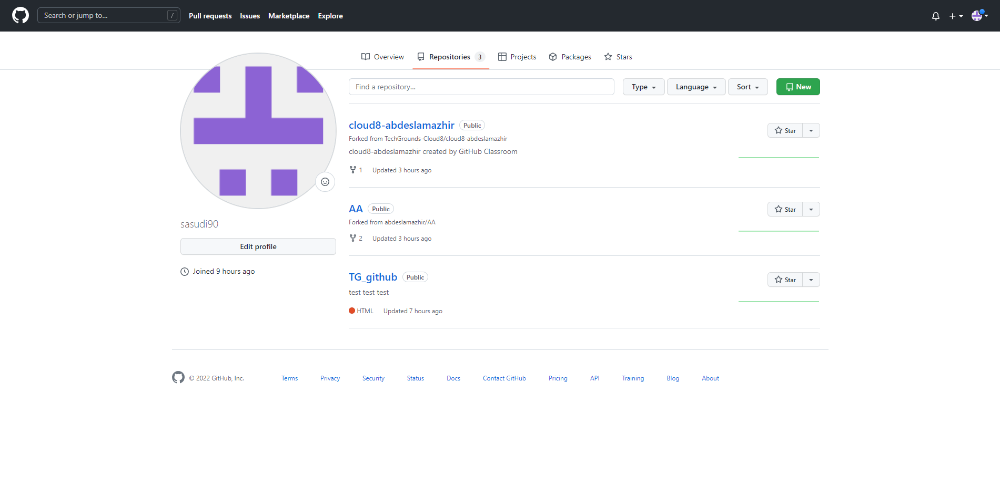

# [Git en Github introduction]
Setting up Git and Github

## [Key terminology]
- git: an open source, distributed version-control system 
- GitHub: a platform for hosting and collaborating on Git repositories 
- Repository = A repository is usually used to organize a single project. Repositories can contain folders and files, images, videos, spreadsheets, and data sets -- anything your project needs.
- Main / Master = "master" is a naming convention for a branch. After cloning (downloading) a project from a remote server, the resulting local repository has a single local branch: the so-called "master" branch. This means that "master" can be seen as a repository's "default" branch.
- Branch = Branching lets you have different versions of a repository at one time.
- Commit = a Git object, a snapshot of your entire repository compressed into a SHA
- Push / Pull = If you have a code change in your repository, and want to move it to a target repository, then: "Push" is you forcing the changes being present in the target repository ( git push ). "Pull" is the target repository grabbing your changes to be present there ( git pull from the other repo)
- Merge = The git merge command lets you take the independent lines of development created by git branch and integrate them into a single branch.
- Fork = a copy of a repository on GitHub owned by a different user

## Exercise
### Sources
1. [Wat is Git en Github](https://kinsta.com/nl/kennisbank/git-vs-github/)
2. [Git cheatsheet](https://training.github.com/downloads/github-git-cheat-sheet/)
3. [How to use Github and VSCode](https://www.youtube.com/watch?v=3Tn58KQvWtU)

### Overcome challanges
Challenges were the meaning of the keywords. Looked it up and went my way. Github Desktop made the implementation of these keywords/commands alot easier. 

### Results
Screenshots say more than words in this case. 

