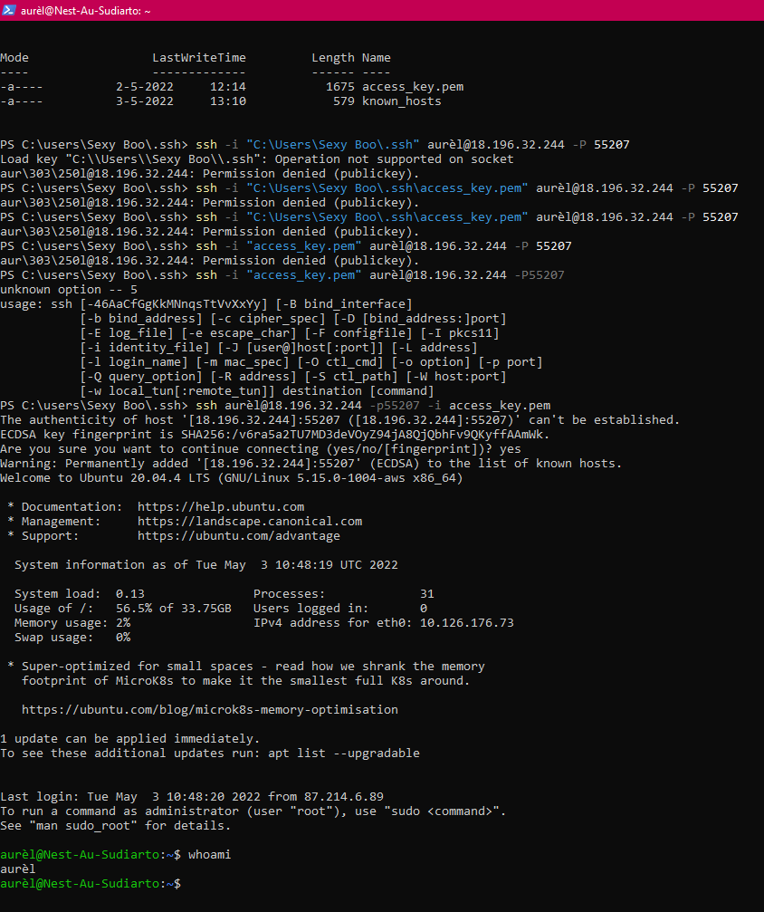
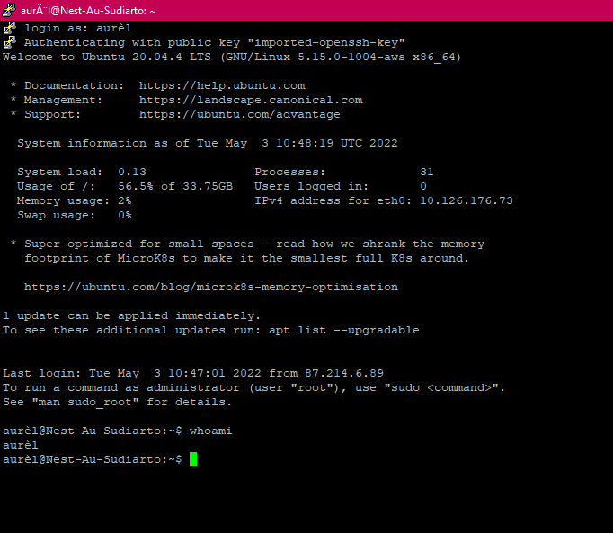

# SSH
Make SSH connection from local computer to virtual machine. 

## Key terminology
- SSH:protocol for securely exchanging data between two computers over an untrusted network. 
- VM: 

## Exercise
1. Make an SSH-connection to your machine. SSH requires the key file to have specific permissions, so you might need to change those.
2. When the connection is successful, type whoami in the terminal. This command should show your username.

### Sources
- [Change permission on file](https://v2cloud.com/tutorials/how-to-change-folder-permissions-on-windows)
- [SSH connection with Putty](https://www.puttygen.com/convert-pem-to-ppk)
- [SSH connection with PowerShell](https://lazyadmin.nl/powershell/powershell-ssh/)

### Overcome challanges
The whole day was a battle. Getting a connection with Putty was slightly easy. But using Powershell (PS) was a real challenge, I could not get the syntax in PS and the file permissions right. 
- How do I make connection with an SSH private key with .pem file in Windows
  - Putty (easy)
  - Powershell (frustrating! almost lost my hope here, couldn't get the csyntax in the cml right)
- What permission setting for .pem private key

### Results
- PowerShell screenshot

- Putty screenshot

