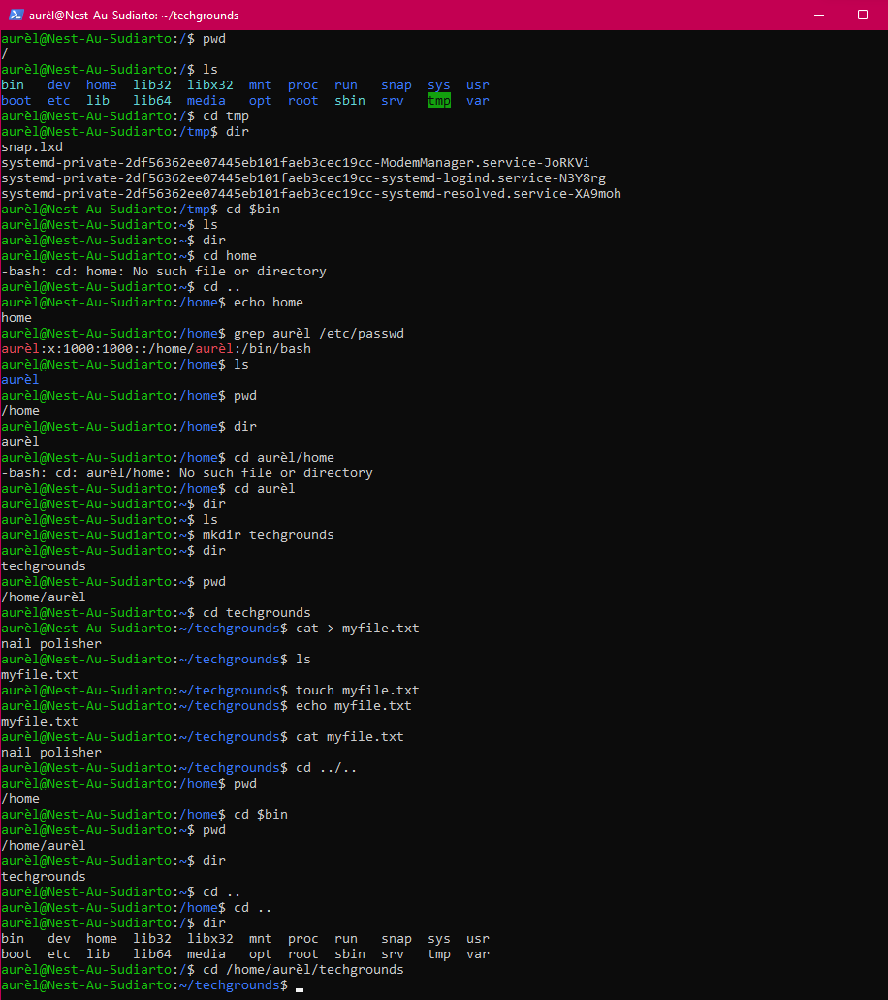

# [Files and Directories]
Creat and navigate through directories, learn some basic commands and create files. 

## Key terminology
- Directory = map
- mkdir = make directory
- dir - list of directories in a directory
- Absolute path = refer to same location in file system relative to root directory (type out every directory till path is complete)
- Relative path = points to a specific location in a file relative to current directory you're from from.
- cd = change directory
- ls = list files and format in a directory

## Exercise
1. Find out your current working directory.
2. Make a listing of all files and directories in your home directory. You should see directories like ‘Desktop’, ‘Public’ and ‘Pictures’ among others.
3. Within your home directory, create a new directory named ‘techgrounds’.
4. Within the techgrounds directory, create a file containing some text.
5. Move around your directory tree using both absolute and relative paths.

### Sources
- Knowledge from the past. I still remembered how to navigate and change directory (cd) or make directories (mkdir).
- [Absolute vs relative directory](http://www.differencebetween.net/technology/difference-between-absolute-and-relative-path/#:~:text=In%20simple%20words%2C%20an%20absolute,directory%20you%20are%20working%20on.)

### Overcome challenges
Refreshed my knowledge.

### Results

