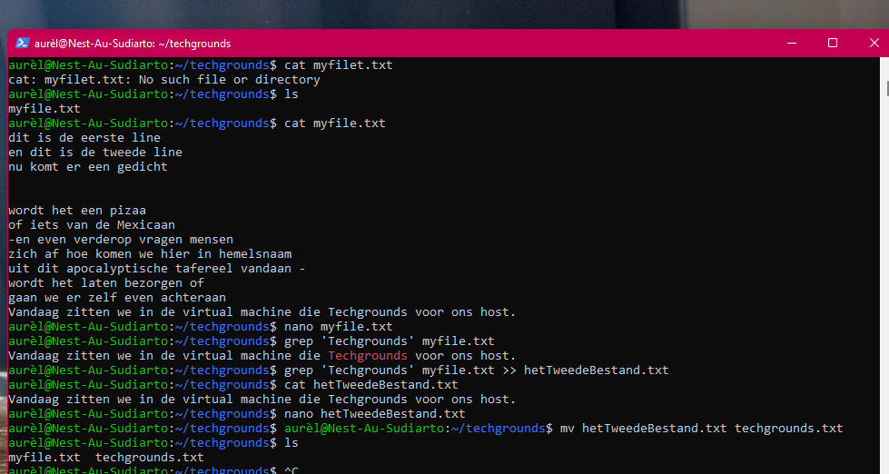

# Working with text(CLI)
Learn how the text editor works in the terminal.

## Key terminology
- cat: literally 'concatenate', command used for viewing, creating and appending files in Linux
- nano: user friendlier (imho) build-in text editor
- grep: filter option, where the query is shown in it's concerning sentence

## Exercise
1. Your Linux machine
2. A text file with 2 lines of text 

### Sources
- [How to read a txt file](https://andysbrainbook.readthedocs.io/en/latest/unix/Unix_03_ReadingTextFiles.html#:~:text=Use%20the%20command%20line%20to,file%20to%20see%20its%20contents.)
- [How to delete file](https://allinfo.space/2019/04/01/het-verwijderen-van-bestanden-en-directories-in-de-linux-terminal/)
- [How to rename file in Linux](https://phoenixnap.com/kb/rename-file-linux)
- [Relative vs absolute paths in Linux](https://www.computernetworkingnotes.com/linux-tutorials/differences-between-absolute-path-and-relative-path-in-linux.html)
  
### Overcome challenges
Needed to look up some commands, no real challenges. I do have some basic knowledge about working in a terminal. 

### Results

