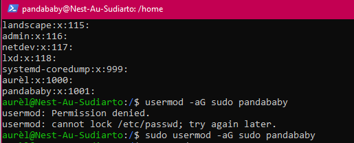
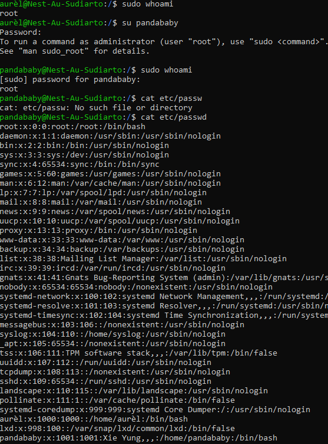

# [Users and groups]
Manage groups and users.

## Key terminology
- sudo

## Exercise
### Sources
- [How to give user sudo authority](https://linuxize.com/post/how-to-add-user-to-sudoers-in-ubuntu/)
- [How to add user to group](https://linuxize.com/post/how-to-add-user-to-group-in-linux/)

### Overcome challanges
[Give a short description of your challanges you encountered, and how you solved them.]

### Results
- Added a new user 
  
- Added a group and new user 
- Proof of sudo new user and in a new group by using command: cat etc/group/[proof sudo group](../00_includes/04-LIN_proofSudoGroup.png)
