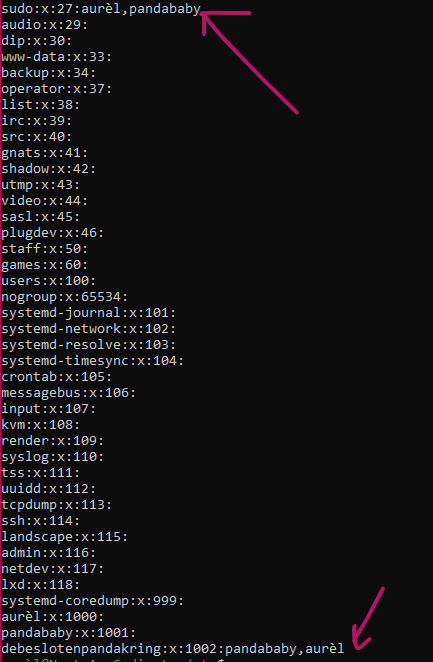

# [Users and groups]
Manage groups and users.

## Key terminology
- sudo: almighty power to bypass permissions
- sudo usermod -aG sudo: give user almighty sudo power 
- groupadd: create group

## Exercise
- Create a new user in your VM. 
  - The new user should be part of an admin group.
  - The new user should have a password.
  - The new user should be able to use ‘sudo’
- Locate the files that store users, passwords, and groups. See if you can find your newly created user’s data in there

### Sources
- [How to give user sudo authority](https://linuxize.com/post/how-to-add-user-to-sudoers-in-ubuntu/)
- [How to add user to group](https://linuxize.com/post/how-to-add-user-to-group-in-linux/)

### Overcome challanges
How do I
- create a new user and log in to that user with use of a password 
- give new user 'sudo' permission
- how to see if user or group is made succesfully (still remembered this part!)

### Results
- Added a new user with 'sudo useradd' and check with 'cat etc/group' or 'cat etc/passwd'
  
- Screenshot of user in *sudo group* and in a new group using the command **cat etc/group**
  
- Proof of sudo new user and in a new group by using command: cat etc/group/ 
  
