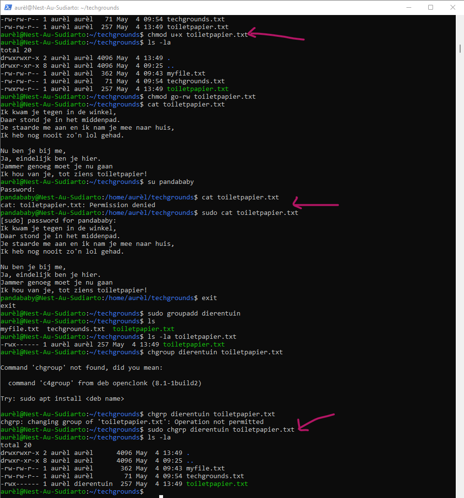
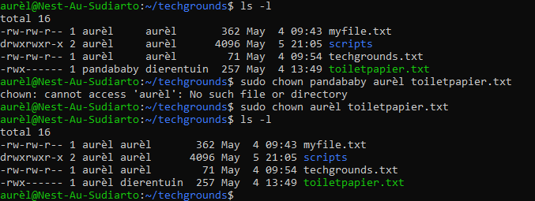

# File permissions
Understanding and changing file permissions, change group and change owner of files. 

## Key terminology
- chmod: change permissions
- chgrp: change group
- chown: change owner
- u, g, o: user, group, others
- r, w, x: read, write, execute
- groupadd: create new group
- ls -l: show file or directory, size, modified date and time, file or folder name and ownder of the file and its permissions
- ls -lh: shows sizes in human-readable format.
- 

## Exercise
1. Create a text file.
2. Make a long listing to view the file’s permissions. Who is the file’s owner and group? What kind of permissions does the file have?
3. Make the file executable by adding the execute permission (x).
4. Remove the read and write permissions (rw) from the file for the group and everyone else, but not for the owner. Can you still read it?
5. Change the owner of the file to a different user. If everything went well, you 6. shouldn’t be able to read the file unless you assume root privileges with ‘sudo’.
7. Change the group ownership of the file to a different group.

### Sources
- [File permissions, how to read and change](https://kb.iu.edu/d/abdb#:~:text=To%20view%20the%20permissions%20for,in%20a%20directory%20in%20Unix.&text=In%20the%20output%20example%20above,a%20file%20or%20a%20directory.)
- [How to change group](https://linuxize.com/post/chgrp-command-in-linux/)

### Overcome challanges
Looked up the commands :D

### Results
- Used the following relevant commands mentioned in the screenshot
1. chmod u+x 
2. chmod go-rw
3. sudo groupadd
4. ls -la
5. sudo chgrp

- changed owner by using 'chmown' 

