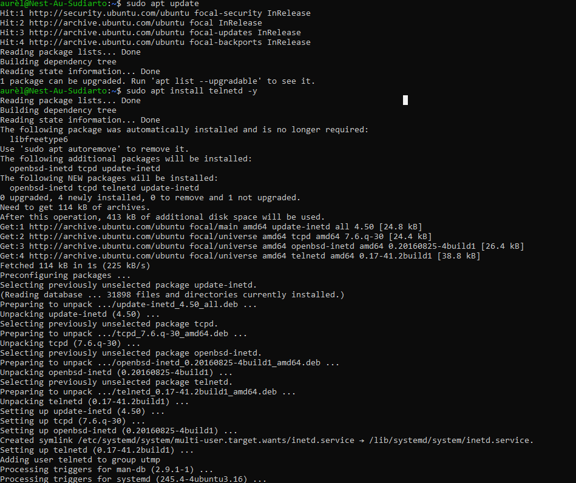
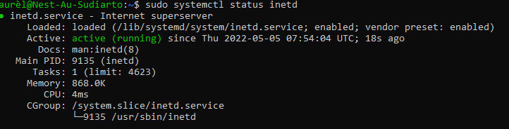
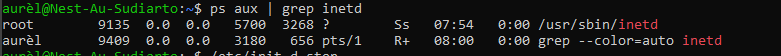
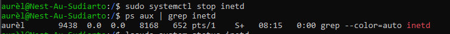
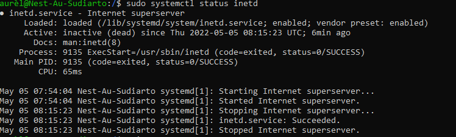

# Processes
Start, check and end processes.

## Key terminology
- daemon: service process running in background to monitor and manage system services
- apt install telnetd -y: install telnetd and automate with -y
- ps aux: process status 
  - a = show processes for all users
    u = display the process's user/owner
    x = also show processes not attached to a terminal
- grep: filter option 
- ps aux | grep inetd: get PID of inedt by using grep filter option
- systemctl: a command responsible for examining and controlling the systemd system and service manager 
- systemctl *status* inetd: shows status (pid, memory) of process 'inetd' in this particular case. 
- systemcl *stop* inetd: stops a specific process in this case inetd

## Exercise
1. Start the telnet daemon.
2. Find out the PID of the telnet daemon.
3. Find out how much memory telnetd is using.
4. Stop or kill the telnetd process.

### Sources
- [How to start and check status telnet daemon](https://www.javatpoint.com/linux-telnet-command)
- [Stop service process](https://youtube.com/clip/UgkxBoKt0so_dD99dDL8_ruDb3C9m1cag6VV)

### Overcome challenges
- What is daemon?
- How do I install daemon? 
- How to check status of process?
- How do I stop a specific process?

### Results
- First update and then install 
- 
- 
- 
- 

