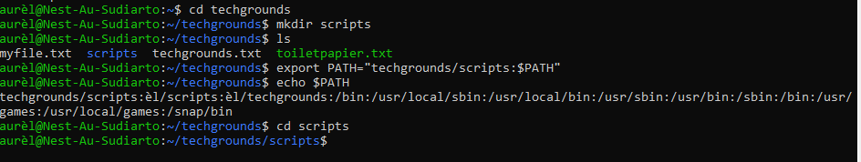
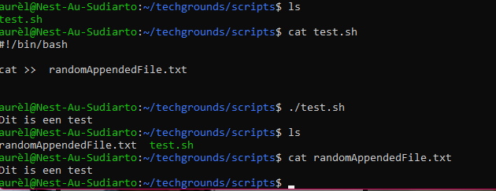
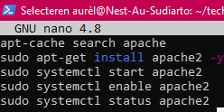

# Bash scripts
Create scripts and run them.

## Key terminology
- $PATH: variable that can be configured to tell our Linux system where to look for certain program
- Bash: UNIX command language interpreter that executes commands read from the standard input or from a file
- httpd: piece of software that listens for network requests (listener)

## Exercise
7.1
1. Create a directory called ‘scripts’. Place all the scripts you make in this directory.
2. Add the scripts directory to the PATH variable.
3. Create a script that appends a line of text to a text file whenever it is executed.
4. Create a script that installs the httpd package, activates httpd, and enables httpd. Finally, your script should print the status of httpd in the terminal.
   
7.2
- Create a script that generates a random number between 1 and 10, stores it in a variable, and then appends the number to a text file.

7.3
- Create a script that generates a random number between 1 and 10, stores it in a variable, and then appends the number to a text file only if the number is bigger than 5. If the number is 5 or smaller, it should append a line of text to that same text file instead.

### Sources
- [How to add directory to ¤PATH](https://www.howtogeek.com/658904/how-to-add-a-directory-to-your-path-in-linux/)
- [Append to end of .txt](https://www.linuxfordevices.com/tutorials/linux/append-text-to-the-end-of-a-file-in-linux)
- [Bash beginners tutorial](https://tldp.org/LDP/Bash-Beginners-Guide/html/sect_02_01.html)
- [Install httpd server](https://mkyong.com/apache/how-to-install-apache-http-server-in-ubuntu/)
 
2 & 3
- [Random number generator in bash](https://coderwall.com/p/s2ttyg/random-number-generator-in-bash)
- [If else statement](https://tecadmin.net/tutorial/bash-scripting/bash-if-else-statement/)

### Overcome challanges
How do I
- add a path to the $PATH variable 
- append a text to a .txt
- how to install httpd
- use the if else statement in bash

### Results
- Added a path to $PATH
- Script that appends a line of text to a .txt whenever executed
- Script that install httpd, Apache2 in this case. Automated with -y . End with a status check. 
  -
- Script that stores a generated number in a variable![script3]
  - (../00_includes/07-LIN_script3.png) 
- Script with if else function![script4]
  -(../00_includes/07-LIN_script4.png)
