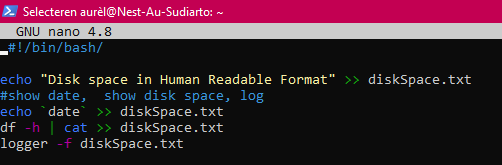
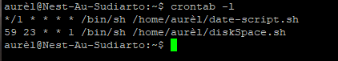
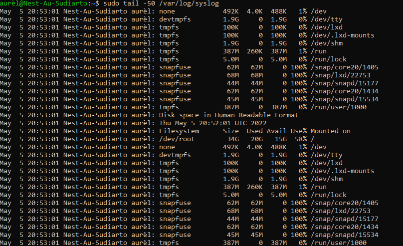

# Cron Job
Study and create a 'cron job'.

## Key terminology
- cron: job scheduling utility 
- crontab: tables where running predefined scripts are stored
- crontab -e: edits crontab entries to add, delete, or edit cron jobs
- crontab -l: list all the cron jobs for the current user
- df -h: shows disk space in human-readable format
- logger: command to add log files to /var/log/syslog
- logger -f: log the contents of a file to syslog
- logger 'comment here': adds comment to syslog
- tail '-numberOfLines' /var/log/syslog: use sudo to use this command to read syslog 
- syslog: is a way network devices can use a standard message format to communicate with a logging server. It was designed specifically to make it easy to monitor network devices

## Exercise
1. Create a Bash script that writes the current date and time to a file  in your home directory.
2. Register the script in your crontab so that it runs every minute.
3. Create a script that writes available disk space to a log file in ‘/var/logs’. Use a cron job so that it runs weekly.

### Sources
- [Cron jobs in Linux](https://www.freecodecamp.org/news/cron-jobs-in-linux/)
- [Cron expression](https://crontab.guru/#0_0_*_*_5)
- [What is syslog?](https://www.rapid7.com/blog/post/2017/05/24/what-is-syslog/)
- [How to use 'logger'](https://www.networkworld.com/article/3274570/using-logger-on-linux.html)
- [How to check free disk space](https://opensource.com/article/18/7/how-check-free-disk-space-linux#:~:text=Linux%20df%20command,space%20on%20the%20Linux%20system.&text=df%20%2DT%20shows%20the%20disk,ext3%2C%20btrfs%2C%20etc.)
  
### Overcome challanges
Looked up the following:
- What's a cron (job)?
- How to create, start and see cronjobs
- How to check diskspace?
- How to comment in var/log/?

### Results

- Cron job running 'date-out.sh' every minute!
  - [cronjob1](../00_includes/08-LIN_cronjob1.png)
- Cron disk space script
  - 
- Cron list en when the cron events are running.
  -  
- Reading out var/log 