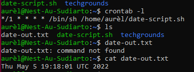

# Cron Job
[Give a short summary of the subject matter.]

## Key terminology
[Write a list of key terminology with a short description. To prevent duplication you can reference to previous excersizes.]

## Exercise
1. Create a Bash script that writes the current date and time to a file  in your home directory.
2. Register the script in your crontab so that it runs every minute.
3. Create a script that writes available disk space to a log file in ‘/var/logs’. Use a cron job so that it runs weekly.

### Sources
[List your sources you used for solving the exercise]
- https://www.freecodecamp.org/news/cron-jobs-in-linux/
- https://opensource.com/article/18/7/how-check-free-disk-space-linux#:~:text=Linux%20df%20command,space%20on%20the%20Linux%20system.&text=df%20%2DT%20shows%20the%20disk,ext3%2C%20btrfs%2C%20etc.)
- https://crontab.guru/#0_0_*_*_5
- https://www.networkworld.com/article/3274570/using-logger-on-linux.html

### Overcome challanges
[Give a short description of your challanges you encountered, and how you solved them.]

### Results
-
-
-
-