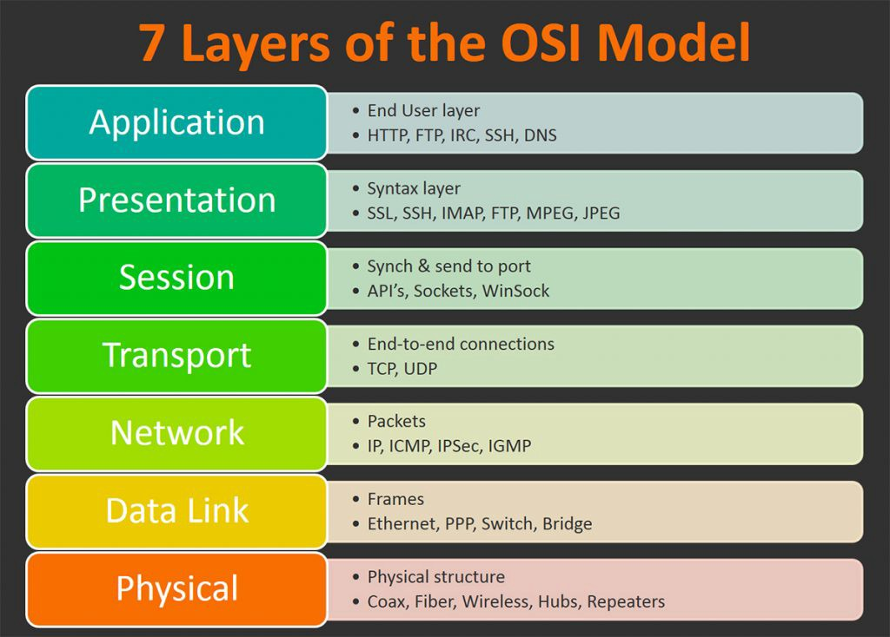

# OSI stack
Study OSI and the TCP/IP model.

## Key terminology
OSI: Open Systems Interconnection model, used for troubleshooting, 7 layers
TCP/IP: Transmission Control Protocol/InternetProtocol

## Exercise
The OSI model and its uses.
The TCP/IP model and its uses.

### Sources
- [OSI and TCP/IP models](https://www.youtube.com/watch?v=kCuyS7ihr_E)
- [Difference between the models](https://www.guru99.com/difference-tcp-ip-vs-osi-model.html#:~:text=OSI%20refers%20to%20Open%20Systems,both%20connection%2Doriented%20and%20connectionless.)

### Overcome challenges
- What's OSI and TCP/IP?
- Where do they differ from each other?

### Results
The OSI and TCP/IP models are networkprotocols; a set of rules for routing and addressing packets of data so that they can travel safely across networks and arrive at their correct destionation. Note: there's an 'updated' version of de TCP/IP model. 
- The protocols and their layers, updated TCP/IP included
- OSI layers 

Key differences between the 2 models in usage:
- OSI has 7 layers and TCP/IP 5 layers.
- OSI model is used more likely to be used for troubleshooting, it's a logical and conceptual model which defines network communication used by systems open to the inetner and communication with other systems. TCP/IP helps to detemind how a specific computer should be connected to the net and it's transmition. 

