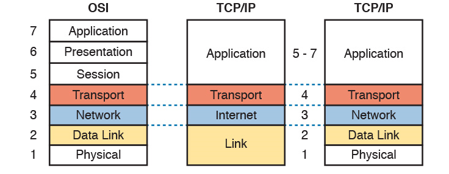
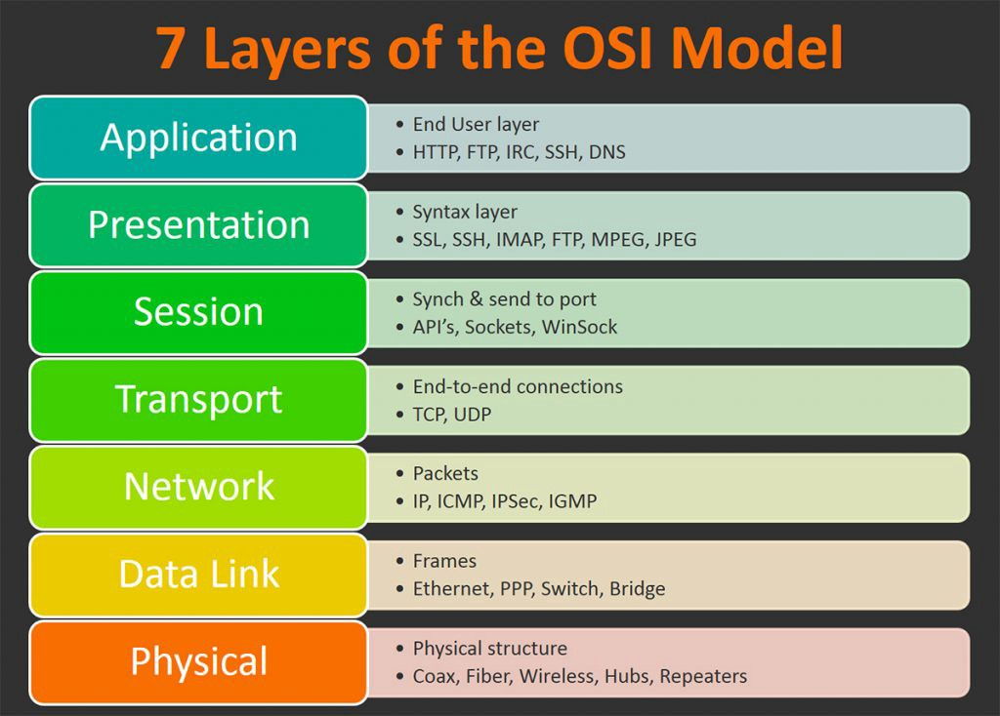

# OSI stack
Study OSI and the TCP/IP model.

## Key terminology
OSI: Open Systems Interconnection model, used for troubleshooting, 7 layers
TCP/IP: Transmission Control Protocol/InternetProtocol

OSI layers: 
1. Physical Layer (Layer 1) :
The lowest layer of the OSI reference model is the physical layer. It is responsible for the actual physical connection between the devices. The physical layer contains information in the form of bits. It is responsible for transmitting individual bits from one node to the next.
2. Data Link Layer (DLL) (Layer 2) :
The data link layer is responsible for the node-to-node delivery of the message. The main function of this layer is to make sure data transfer is error-free from one node to another, over the physical layer.
3. Network Layer (Layer 3) :
The network layer works for the transmission of data from one host to the other located in different networks. It also takes care of packet routing i.e. selection of the shortest path to transmit the packet, from the number of routes available. The sender & receiver’s IP addresses are placed in the header by the network layer. 
4. Transport Layer (Layer 4) :
The transport layer provides services to the application layer and takes services from the network layer. The data in the transport layer is referred to as Segments. It is responsible for the End to End Delivery of the complete message.
5. Session Layer (Layer 5) :
This layer is responsible for the establishment of connection, maintenance of sessions, authentication, and also ensures security. 
6. Presentation Layer (Layer 6) :
The presentation layer is also called the Translation layer. The data from the application layer is extracted here and manipulated as per the required format to transmit over the network. 
7. Application Layer (Layer 7) :
At the very top of the OSI Reference Model stack of layers, we find the Application layer which is implemented by the network applications. 

- Bottom up approach: approach which starts at the physical (layer 1)
 of the OSI model and works it's way up. Designing a network with this approach is said to be faster. Bottom-up troubleshooting is a good approach to use when the problem is suspected to be a physical one.

- Top down approach: approach starting with the needs of the organization (layer 7: application) and provides more flexibility when redesigning a network and less probability of failure. When troubleshooting: End-user applications of an end system are tested before tackling the more specific networking pieces. 

## Exercise
- The OSI model and its uses.
- The TCP/IP model and its uses.
  
### Sources
- [OSI and TCP/IP models](https://www.youtube.com/watch?v=kCuyS7ihr_E)
- [Difference between the models](https://www.guru99.com/difference-tcp-ip-vs-osi-model.html#:~:text=OSI%20refers%20to%20Open%20Systems,both%20connection%2Doriented%20and%20connectionless.)

### Overcome challenges
- What's OSI and TCP/IP?
- Where do they differ from each other?

### Results
The OSI and TCP/IP models are networkprotocols; a set of rules for routing and addressing packets of data so that they can travel safely across networks and arrive at their correct destionation. Note: there's an 'updated' version of de TCP/IP model. 
- The protocols and their layers, updated TCP/IP included
- OSI layers 

Key differences between the 2 models in usage:
- OSI has 7 layers and TCP/IP 5 layers.
- OSI model is used more likely to be used for troubleshooting, it's a logical and conceptual model which defines network communication used by systems open to the inetner and communication with other systems. TCP/IP helps to detemind how a specific computer should be connected to the net and it's transmition. 

