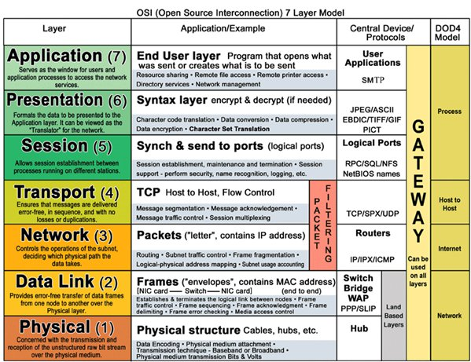
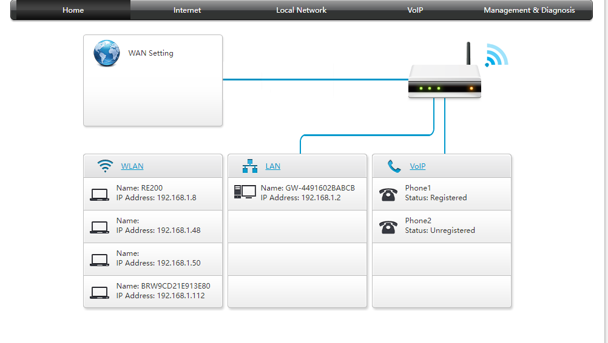
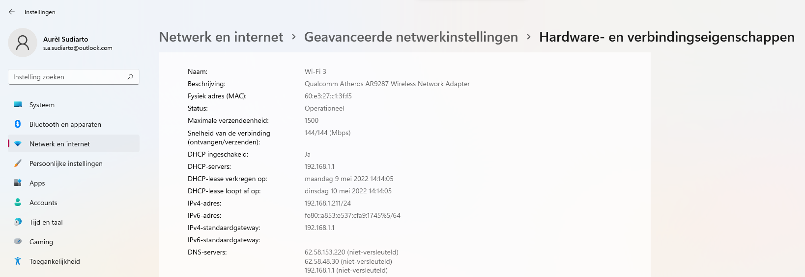

# Network Devices
Study network devices in relation to the OSI environment.

## Key terminology
Common network devices: 
- repeater; this device belongs to **layer 1; physical**. It regenerates the signal over the same network before the signal becomes to weak.
- hub: multiport repeater on **layer 1; physicial**. These devices connect multiple wires coming from different branches, they can't filter data  and do not have the build-in intelligence to find out best path for data packets. 
- bridge; this device operates at **layer 2; data link**. This device is a repeater with add on functionality of filtering content by reading MAC adresses of the communicating systems. 
- switch; The switch operates at **layer 2; data link**. A switch is a multiport bridge with a buffer and a design that can boost its efficiency (a large number of ports imply less traffic) and performance (can perform error checking before forwarding data).
- routers: A router is a device like a switch that routes data packets based on their IP addresses. The router is mainly a **Network Layer device, layer 3**.
- NIC: network interface care is a network adapter that is used to connect the computer to the network by LAN. **layer 2, data link**
- access point: is a hardware device, more of a central hub for devices to connect to a local area network **layer 1, physical**

- Differences between *access points and repeater*: A range extender repeats the wireless signal from your router to expand its reach by creating a second network, while an access point relies on a hardwired connection to your network, rather than simply repeating the existing network.

DHCP: Dynamic Host Configuration Protocol is a build in feature on networking devices, such as routers, access points and switches. A DHCP server gives (private) IP adresses to devices connected to the DHCP server (like Oprah giving out free stuff). 

## Exercise
- Benoem en beschrijf de functies van veel voorkomend netwerkapparatuur
- De meeste routers hebben een overzicht van alle verbonden apparaten, vind deze lijst. Welke andere informatie heeft de router over aangesloten apparatuur?
- Waar staat je DHCP server op jouw netwerk? Wat zijn de configuraties hiervan?

### Sources
- [Most common network devices in OSI environment](https://www.geeksforgeeks.org/network-devices-hub-repeater-bridge-switch-router-gateways/)
- [Difference between repeater and access point](http://www.differencebetween.net/technology/difference-between-access-point-and-extender/#:~:text=Access%20point%20is%20a%20wireless,area%20of%20your%20wireless%20network.)
- [Network devices, protocols and the OSI model](https://www.quora.com/What-devices-are-used-in-each-layer-of-the-OSI-model)
- a friend 

### Overcome challenges
- What are the most common network devices and to which layer of the OSI model do they belong? 
- What's DHCP?

### Results
- Network devices and where they belong in the OSI model
  - 
- Connected devices to router. Extra information would be the private IP adresses given by the router.
  - DHCP server can be found at the default gateway on the router (which I can find in the CMD using ipconfig /all; 192.168.1.1). Configuration is done automaticly.
  - 
  - Configuration of DHCP server