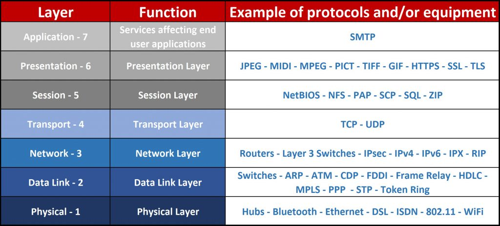
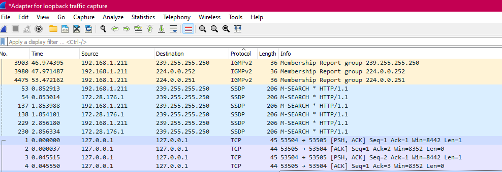

# Protocols
Identifying protocols 

## Key terminology
- TCP: Transmission control Protocol: to ensure reliable transmission of packets.
- UDP: User Datagram Protocol is used for  time-sensitive transmissions such as video playback. It speeds up communications by not formally establishing a connection before data is transferred. This allows data to be transferred very quickly, but it can also cause packets to become lost in transit — and create opportunities for exploitation in the form of DDoS attacks.
- fire and forget: On local networks, applications can send Fire-and-Forget messages through UDP (User Datagram Protocol). UDP is connection-less, and does not require a sync up between sender and receiver. Therefore, it is extremely efficient. However, UDP is not reliable, and carries "at most once" semantics for message delivery
- three way handshake: two computers begin by establishing a connection via an automated process called a ‘handshake.’ Only once this handshake has been completed will one computer actually transfer data packets to the other.
- 
- HTTPS: Hypertext transfer protocol secure (HTTPS) is the secure version of HTTP, which is the primary protocol used to send data between a web browser and a website. 

## Exercise
1. Identify several other protocols and their associated OSI layer. Name at least one for each layer.
2. Figure out who determines what protocols we use and what is needed to introduce your own protocol.
3. Look into wireshark and install this program. Try and capture a bit of your own network data. Search for a protocol you know and try to understand how it functions.

### Sources
- [TCP](https://www.khanacademy.org/computing/computers-and-internet/xcae6f4a7ff015e7d:the-internet/xcae6f4a7ff015e7d:transporting-packets/a/transmission-control-protocol--tcp)
- [UDP](https://www.cloudflare.com/learning/ddos/glossary/user-datagram-protocol-udp/)
- [HTTPS](https://www.cloudflare.com/learning/ssl/what-is-https/)
- [Internet Protocols Suite](https://www.sciencedirect.com/topics/computer-science/internet-protocol-suite)
- [Organizations dedicated to defining internet protocols and standards](https://www.internetx.com/en/news-detailview/who-creates-the-standards-and-protocols-for-the-internet/#:~:text=The%20Internet%20Assigned%20Numbers%20Authority,a%20subsidiary%20organization%20of%20ICANN.)

### Overcome challanges
- Looked up some key terms concerning the introduction of this exercise.
- Looked up the different protocols suiting their layers in the OSI mode.

### Results
1. Different kinds of protocols per layer of OSI model
   - 
2. Organizations that help define internet protocols and standards:
   - World Wide Web Consortium
   - Telecommunication Standardization Sector
   - Internet Society (ISOC)
   - Internet Engineering Task Force (IETF)
   - Internet Research Task Force (IRTF)
   - Internet Assigned Numbers Authority (IANA)
- How to introduce own protocol:
    - ?
3. Screenshot of WireShark capturing data traffix

