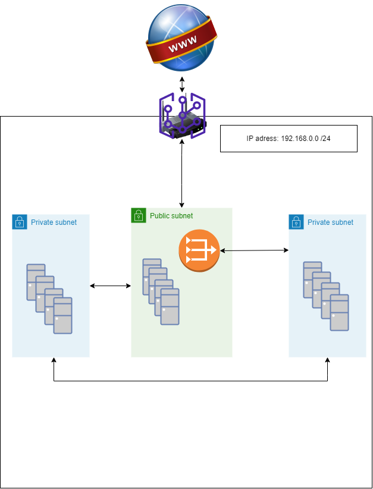

# [Subnetting]
Get to know how subnetting works and create a network architecture with this newfound knowledge. 

## Key terminology
- LAN: Stands for Local Area Network. It's a structure for organizing and protecting network communicayions for devices running within a single router. 
- subnet mask: defines the range of IP adresses that can be used within a network or subnet and seperates an IP address into two parts; network bits and host bits.
- CIDR: Classless Inter-Domain Routing. 

## Exercise
- Maak een netwerkarchitectuur die voldoet aan de volgende eisen:
  - 1 private subnet dat alleen van binnen het LAN bereikbaar is. Dit subnet moet minimaal 15 hosts kunnen plaatsen.
  - 1 private subnet dat internet toegang heeft via een NAT gateway. Dit subnet moet minimaal 30 hosts kunnen plaatsen (de 30 hosts is exclusief de NAT gateway.
  - 1 public subnet met een internet gateway. Dit subnet moet minimaal 5 hosts kunnen plaatsen (de 5 hosts is exclusief de internet gateway).
- Plaats de architectuur die je hebt gemaakt inclusief een korte uitleg in de Github repository die je met de learning coach hebt gedeeld.

### Sources
-   [LAN and CIDR](https://www.freecodecamp.org/news/what-is-a-lan-local-area-network-explained-in-plain-english/)
-   [Subnet mask](https://www.freecodecamp.org/news/subnet-mask-definition/)
-   [NAT](https://www.uturndata.com/2021/02/23/aws-quick-tips-internet-gateways-nat-gateways-and-nat-instances/#:~:text=A%20NAT%20Gateway%20is%20an,created%20in%20a%20public%20subnet.)
-   [AWS subnet](https://docs.aws.amazon.com/vpc/latest/userguide/VPC_Internet_Gateway.html)
-   [Subnet calc](https://www.calculator.net/ip-subnet-calculator.html?cclass=any&csubnet=24&cip=192.168.0.0&ctype=ipv4&printit=0&x=61&y=23)
-   Fellow student
  

### Overcome challanges
- Looked up keywords
- Looked up subnet mask and subnetting
- Headaches. 

### Results
- Took the architecture from a cloud perspective. 
  - The cloud gives the access to the internet, let's call that the internet gateway; the front door (with a public and private IP adress) of our little network. 
  - The LAN is suppose to have at least 52 'hosts', there's no maximum given. To divide the different subnets inside our LAN we chose a total of 254 hosts with CIDR notation /24. Where the private IP adress range is between 192.168.0.1 - 192.168.0.254 to divide over the subnets. 
    - Internet gateway: 192.168.0.1
    - NAT: 192.168.0.2
    - Public subnet: 192.168.0.10 - 192.168.0.20 (at least 5 hosts)
    - NAT private subnet: 192.168.0.30 - 195.168.0.70 (at least 30 hosts)
    - LAN private subnet: 192.168.0.90 - 192.168.0.120 (at least 15 hosts)
  - Subnet mask would be 255.255.255.0 if classes weren't outdated yet. 

