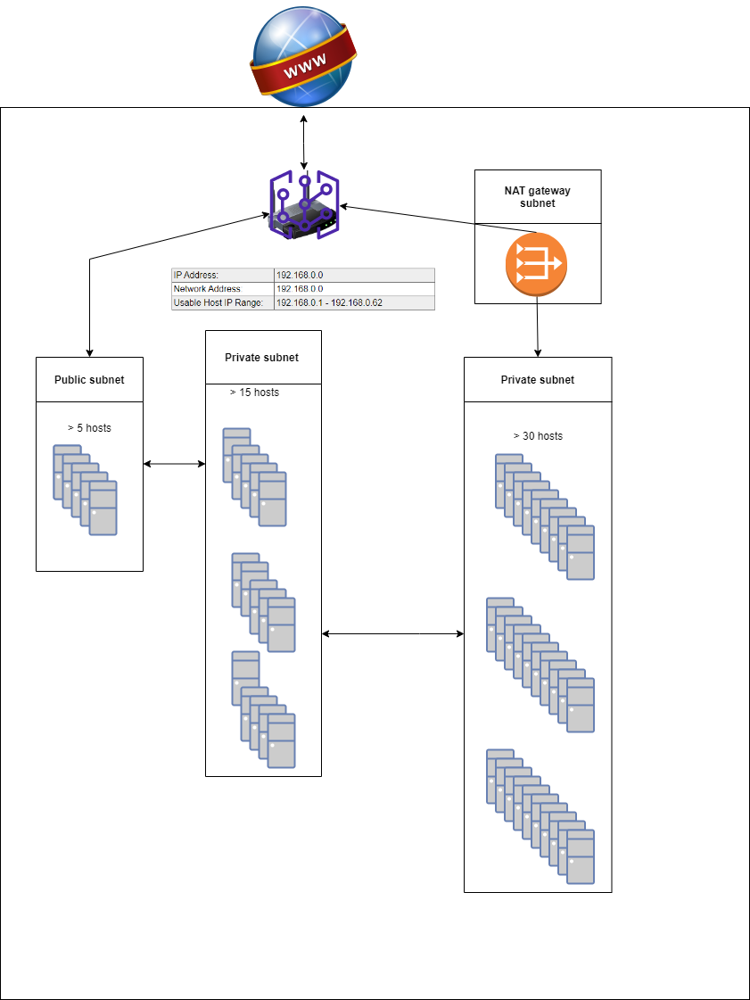

# [Subnetting]
Get to know how subnetting works and create a network architecture with this newfound knowledge. 

## Key terminology
- LAN: Stands for Local Area Network. It's a structure for organizing and protecting network communicayions for devices running within a single router. 
- subnet mask: defines the range of IP adresses that can be used within a network or subnet and seperates an IP address into two parts; network bits and host bits.
- CIDR: Classless Inter-Domain Routing. 

## Exercise
- Maak een netwerkarchitectuur die voldoet aan de volgende eisen:
  -  1 private subnet dat alleen van binnen het LAN bereikbaar is. Dit subnet moet minimaal 15 hosts kunnen plaatsen.
  - 1 private subnet dat internet toegang heeft via een NAT gateway. Dit subnet moet minimaal 30 hosts kunnen plaatsen (de 30 hosts is exclusief de NAT gateway.
  - 1 public subnet met een internet gateway. Dit subnet moet minimaal 5 hosts kunnen plaatsen (de 5 hosts is exclusief de internet gateway).
- Plaats de architectuur die je hebt gemaakt inclusief een korte uitleg in de Github repository die je met de learning coach hebt gedeeld.

### Sources
-   [LAN and CIDR](https://www.freecodecamp.org/news/what-is-a-lan-local-area-network-explained-in-plain-english/)
-   [Subnet mask](https://www.freecodecamp.org/news/subnet-mask-definition/)
-   [NAT](https://www.uturndata.com/2021/02/23/aws-quick-tips-internet-gateways-nat-gateways-and-nat-instances/#:~:text=A%20NAT%20Gateway%20is%20an,created%20in%20a%20public%20subnet.)
-   Fellow student
  

### Overcome challanges
- Looked up keywords
- Looked up subnet mask and subnetting

### Results
- Took the architecture from a cloud perspective. 
  - The cloud gives the acces to the internet, let's call that the internet gateway; the front door (with a public IP adress) of our little network. 
  - To divide the different subnets inside our LAN we chose a total of 62 hosts with CIDR notation /26. Where the IP adress range is between 192.168.0.1 - 192.168.62 to divide over the subnets. 
  - It is possible to chose an 10.0.0.0 or 172.0.0.0 depending on how many hosts are needed. 

