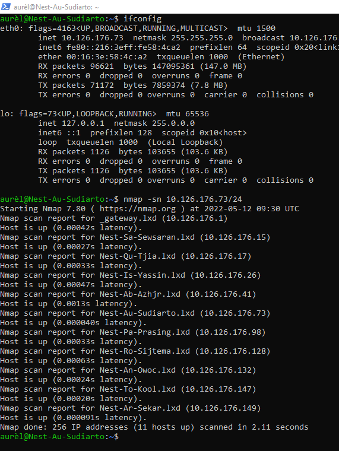
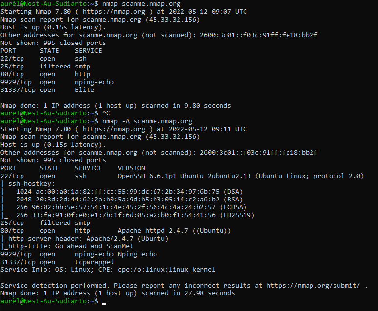
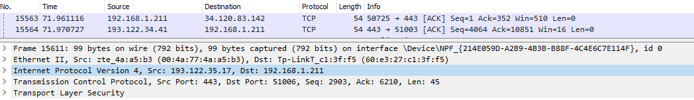

# Network detection
Scan a network using nmap and analyse it by using Wireshark. 

## Key terminology
nmap: network mapper. It's a tool inside Linux to scan IP adresses and ports in a network and to detect installed applications. 
nmap scanme.nmap.org: Scans a single host for 1000 well-known ports. These ports are the ones used by popular services like SQL, SNTP, apache, and others.
nmap -A scanme.nmap.org: Nmap has an aggressive mode that enables OS detection, version detection, script scanning, and traceroute. You can use the -A argument to perform an aggressive scan.

## Exercise
- Scan the network of your Linux machine using nmap. What do you find?
- Open Wireshark in Windows/MacOS Machine. Analyse what happens when you open an internet browser. (Tip: you will find that Zoom is constantly sending packets over the network. You can either turn off Zoom for a minute, or look for the packets sent by the browser between the packets sent by Zoom.)

### Sources
- [What's nmap and what is it used for](https://www.freecodecamp.org/news/what-is-nmap-and-how-to-use-it-a-tutorial-for-the-greatest-scanning-tool-of-all-time/)
- [nmap commands and scrips](https://jarnobaselier.nl/nmap-commandos-en-scripts/)

### Overcome challanges
- Looked what nmap is and how to use it.

### Results
- TCP null scan. Use ifconfig first to see personal IP adress. 
  - 
- Screenshot of using 2 nmap commands; scanning a single host for ports and an agressive mode. 
- Wireshark screenshot shows what happends if I open a webbrowser. Filtered on TCP knowing HTTPS used TCP on the transportation layer (4). The screenshot shows there's a source and destination IP adress, a three way handshake, the length of a package and a port number. 
  - 
