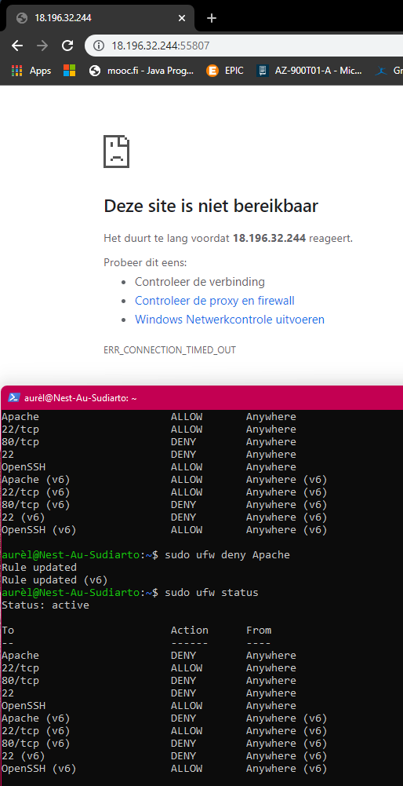

# Firewalls
Study firewalls, statefull and stateless, hardware and software.

## Key terminology
- firewalls: network security that monitors and filters incoming and outgoing network traffic based on established security policies
  - statefull: monitors all aspects of the traffic streams, their characteristics and communication channels.
  - stateless: uses clues from destination adress, source and other key values to asses whether threats are peresent. 
  - hardware: is physical hardware, installed between network elements and connected devices, and is tasked with filtering traffic for cyber threat to the network or devices. Filtering out unauthorized or suspicious users based on traffic analysis is one of the biggest benefits of hardware firewall.
  - software: is installed on computer or server; working with a wide variety of other IT security solutions to provide more robust and cohesive security for enterprises of all sizes.
  - apache2 -version

## Exercise
1. Installeer een webserver op je VM.
2. Bekijk de standaardpagina die met de webserver geïnstalleerd is.
3. Stel de firewall zo in dat je webverkeer blokkeert, maar wel ssh-verkeer toelaat.
4. Controleer of de firewall zijn werk doet.

### Sources
- [Statefull and stateless](https://www.cdw.com/content/cdw/en/articles/security/stateful-versus-stateless-firewalls.html#:~:text=%2D%20Stateless%20firewalls%20do%20not%20inspect,a%20suitable%20level%20of%20protection.)
- [Firewall: hardware vs software](https://www.sangfor.com/blog/cybersecurity/what-is-software-firewall-difference-between-hardware-firewall-and-software-firewall#:~:text=A%20firewall%20is%20a%20network,users%2C%20and%20the%20internet%20beyond.)
- [ufw](https://www.digitalocean.com/community/tutorials/ufw-essentials-common-firewall-rules-and-commands)

### Overcome challenges
- Key terminology search again!
- Check status of firewall and open/close the ports.

### Results
- 
