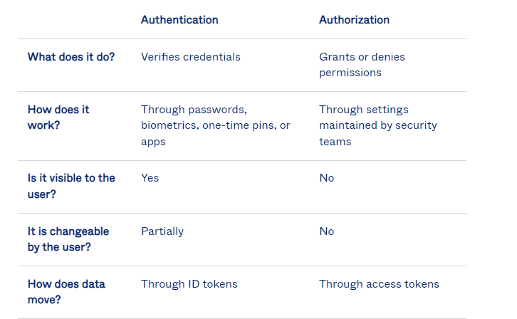

# [Identity and access management]
Study identity and acces management; difference between authentication and authorization. 

## Key terminology
- authentication: validating that users are whom they claim to be. Can be completed with usernames/passwords, one-time pins, authetication apps, biometrics. 
- authorization: process of giving the user permission to access a specific resource or function. Authorization must follow authentication. 
- multi-factor authentication: authentification method that requires two or more verification factors to gain access to specific resource or function. 
- principle of least privilege: information security concept in which a user is given the minimum levels of access – or permissions – needed to perform his/her job functions.

## Exercise
1. The difference between authentication and authorization.
2. The three factors of authentication and how MFA improves security.
3. What the principle of least privilege is and how it improves security.
### Sources
- [Authentication vs authorization](https://www.okta.com/identity-101/authentication-vs-authorization/)
- [MFA](https://www.onelogin.com/learn/what-is-mfa)
- [Principle of Least Privilege](https://www.youtube.com/watch?v=BAcPSxoPZjs)
- [3FA](https://www.techtarget.com/searchsecurity/definition/three-factor-authentication-3FA)

### Overcome challenges
- Looked everything up in text and videos. 

### Results
1. Difference between authentication and authorization
- 
2. Authentification factores :
   -  **knowledge** something you know: a password or personal identification number (PIN);
   - **possession** something you have: a token, such as bank card;
   - **inherence** something you are: biometrics, such as fingerprints and voice recognition.
 - Improves security by the following:
   - it assures identity
   - provides more layers of security
   - non invasive/easy implementation
3. The principle of least privilege addresses access control and states that an individual should have only the minimum access privileges necessary to perform a specific job or task and nothing more. 
   - Overly privileged users can easily put the organization’s data at risk through error, ignorance, or negligence as well as through intentional malicious acts by a vengeful insider. Restricting users’ ability to install or run unapproved applications can protect endpoints from becoming infected with malware or ransomware and, in turn, reduce the chances of it spreading throughout the organization.
