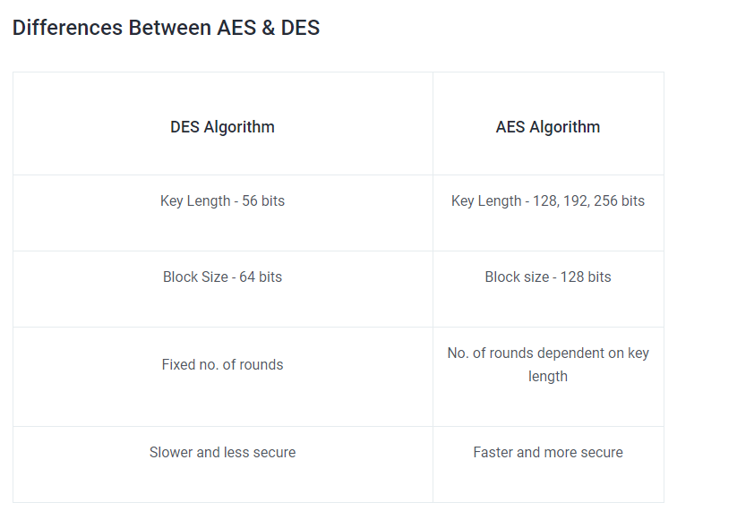
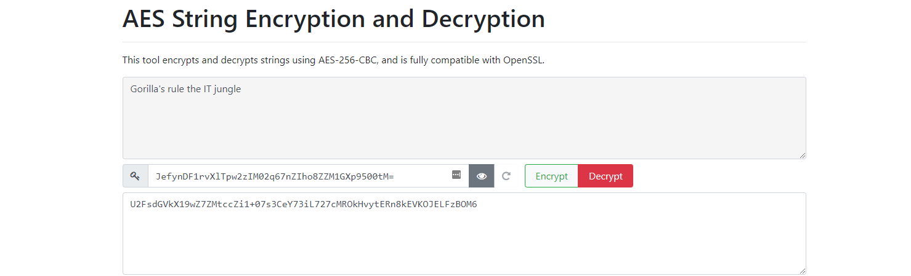

# [Symmetric encryption]
Study symmetric encryption. 

## Key terminology
- symmetric encryption: also called private key encryption. Type of encryption where there's just a single key to encrypt and decrypt data
  - Symmetric encryption may have stream and block modes. Stream mode means each bit is independently encrypted in a “stream.” Block mode ciphers encrypt blocks of data each round; for example, 64 bits for the Data Encryption Standard (DES), and 128 bits for AES.
- Caesar cipher: encryption method in which each letter in the plaintext is replaced by a letter some fixed number of positions down the alphabet
- Advanced encryption standard (AES): a.k.a. Rijndael excryption. Has four functions: SubBytes, ShiftRows, MixColumns, and AddRoundKey.

## Exercise
1. Find two more historic ciphers besides the Caesar cipher.
2. Find two digital ciphers that are being used today.
3. Send a symmetrically encrypted message to one of your peers via the public Slack channel. They should be able to decrypt the message using a key you share with them. Try to think of a way to share this encryption key without revealing it to everyone. 
You are not allowed to use any private messages or other communication channels besides Slack. Analyse the shortcomings of this method.

### Sources
- [Symmetric encryption](https://www.sciencedirect.com/topics/computer-science/symmetric-encryption)
- [Historical encryption](https://www.secplicity.org/2017/05/25/historical-cryptography-ciphers/)
- [Types of cryptography](https://www.youtube.com/watch?v=lnKPoWZnNNM)
- [Key generator](https://cryptotools.net/)

### Overcome challenges
- Looked up what symmetric encryption is 
- Looked up different symmetric encryption methods
- Headaches

### Results
1. Two historical ciphers:
   1.  To use the **route cipher**, you write out your plaintext message into a grid of arbitrary dimensions. 
   2.  The **rail fence cipher** is a simple transposition cipher where plaintext characters are re-arranged instead of replaced to encode a message. The rail fence cipher encodes a message by writing it down and up diagonally over successive “rails”, or rows, in an imaginary fence. 
2. Two digital ciphers:
   1. AES: 128, 192 and 256 bit key, how longer the key make the algorithm runs slower (Blowfish for example)
   2. DES: The algorithm takes the plain text in 64-bit blocks and converts them into ciphertext using 48-bit keys
    - 
3. Sharing the key in a public channel is unsafe and is only possible if a private and public key pair is generated to share a secret to put in a secret (inception, ayeee). We used the Diffie-Hellman key exchange and a AES string encryption and decryption. We shouted our public keyd and secret message in the public channel. Below u find the keys and encrypted/decrypted message. 
   - Our public keys and the encrypted message
        
   - Our shared secret decrypted
          
