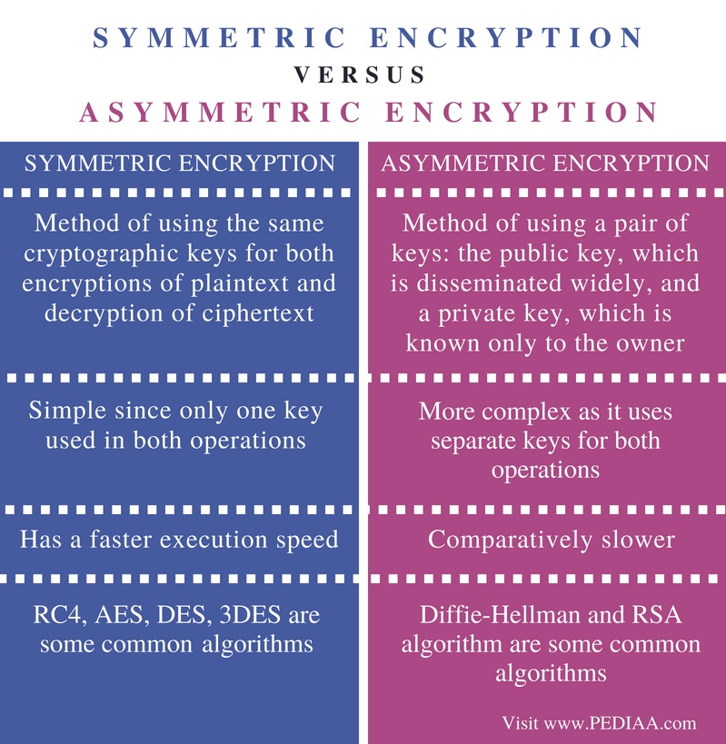
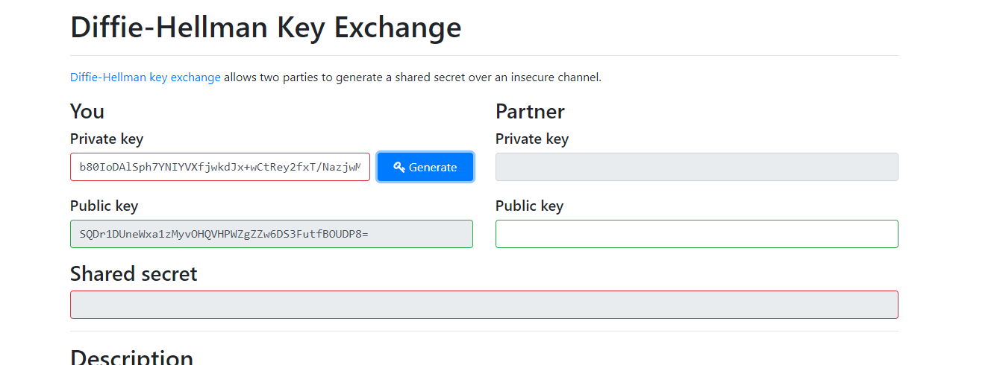
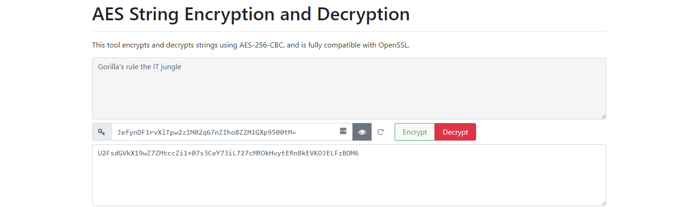

# [Asymmetric encryption]
Study asymmetric encryption; utility of a public and private key.  

## Key terminology
- difference between symmetric and asymmetric:
  
- asymmetric encryption: this type of encryption is different on senders and receivers side. Two different keys are needed, one to encrypt and one to decrypt; public and private key paring. 
- public key: key on receivers end to decrypt an encrypted message
- private key: key on senders end to encrypt a message
- Diffie Hellman algorithm: key exchange protocol that enables two parties over public channel to establish a mutual secret. 

## Exercise
1. Generate a key pair.
2. Send an asymmetrically encrypted message to one of your peers via the public Slack channel. They should be able to decrypt the message using a key you share with them. The recipient should be able to read the message, but it should remain a secret to everyone else.
You are not allowed to use any private messages or other communication channels besides Slack. Analyse the difference between this method and symmetric encryption.

### Sources
- [Diffie Hellman](https://www.simplilearn.com/tutorials/cryptography-tutorial/deffie-hellman-key-exchange)
- [Diffie Hellman](https://www.hypr.com/diffie-hellman-algorithim/)
- [Asymmetric encryption](https://www.youtube.com/watch?v=AQDCe585Lnc&t=135s)

### Overcome challenges
- Looked everything up and puzzled with the usage of the keys with my teams.

### Results
Tried this method out with peer Rolf. First we generated a key pair for ourselves, then exchanged our public keys on the Cloud8 public channel. By exchanging the public keys we generated a secret (code). With our own private codes and the combination of our publics we could exchange encrypted messages backed up by our shared secret code.
- Generating my own key pair on the left. At the right I can put opposing parties public key.
- I tell my public key here and Rolf shares his with the encrypted message. 
- Here is the shared secret code and decrypted messages. 