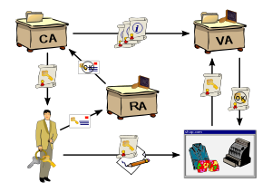
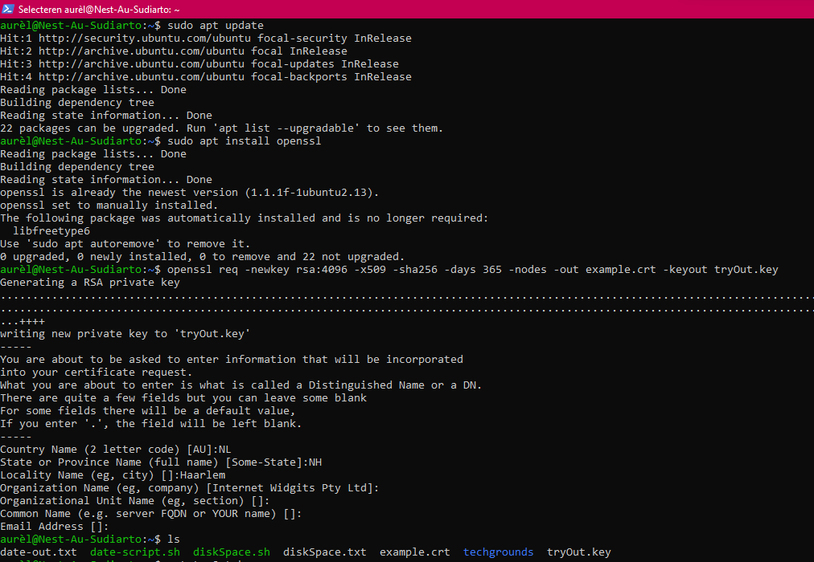
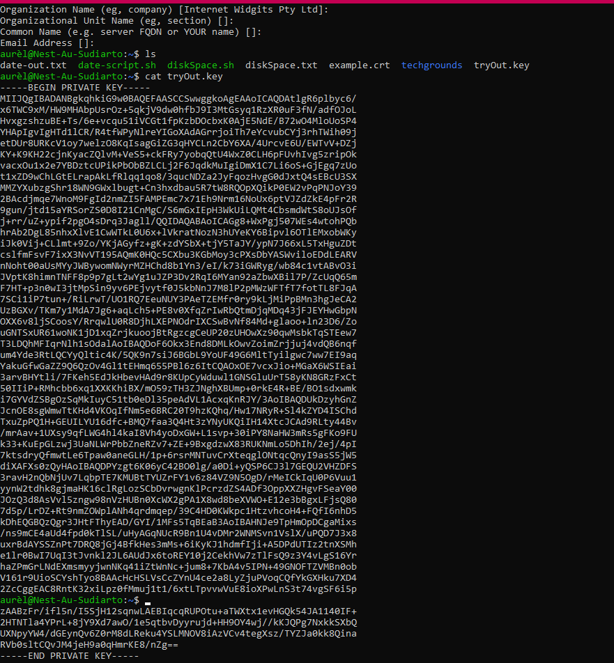
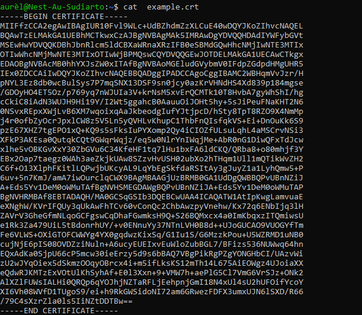
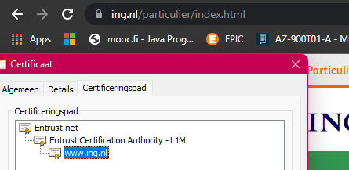
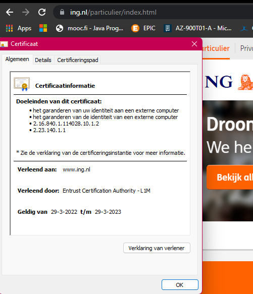
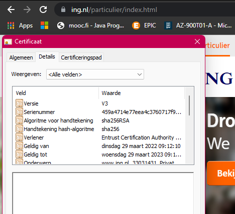
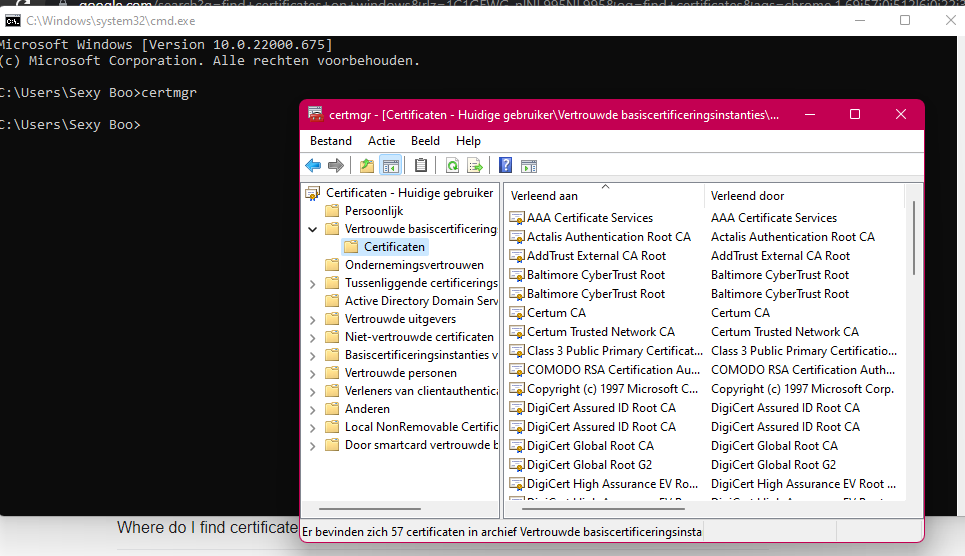
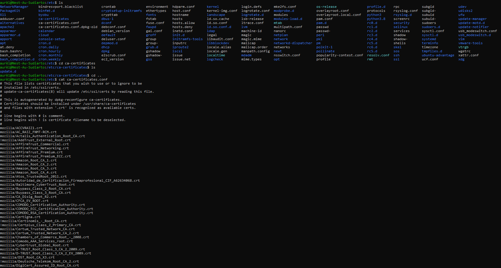

# [Public key infrastructure]
Study public key infrastructure; components, deployment, certificates. 

## Key terminology
- public key infrastructure: set of roles, policies, hardware, software and procedures needed to create, manage, distribute, use, store and revoke digital certificates and manage public-key encryption.
- CIA triangle:
  - Confidentality: designed to prevent sensitive information from unauthorized access attempts
  - integrity: maintaining cosistency, accuracy and trustworthiness of data over an entire lifecycle
  - availability: data should be consistently and readily accessible for authorized parties
- Certificate Authority: stores, issues and signs the digital certificates
- Registration authority: verifies the identity of entities requesting their digital to be stored at the CA.
- Validation authority: provides validation of PKI certificates
- 
- **self-signed certificate** is a digital certificate that’s not signed by a publicly trusted Certificate Authority (CA). Self-signed certificates are considered different from traditional CA certificates that are signed and issued by a CA because self-signed certificates are created, issued, and signed by the company or developer who is responsible for the website or software associated with the certificate.
-  x.509: standard format for public key certificates, digital documents that securely associate cryptographic key pairs with identities such as websites, individuals, or organizations.
-  openssl req -newkey rsa:4096 -x509 -sha256 -days 365 -nodes -out example.crt -keyout example.key: 
   -  -newkey rsa:2048 – creates a new certificate request and 2048 bit RSA key.
   - -x509 – creates a X.509 certificate.
   - -sha256 – use 265-bit SHA (Secure Hash Algorithm) to create the certificate
   -  -days 365 – the number of days to certify the certificate for. Typically a year or more
   - -nodes – creates a key without a passphrase.
   - -out example.crt – specifies the filename to write the newly created certificate to
   - -keyout example.key – specifies the filename to write the private key to.

## Exercise
1. Create a self-signed certificate on your VM.
2. Analyze some certification paths of known websites (ex. techgrounds.nl / google.com / ing.nl).
3. Find the list of trusted certificate roots on your system (bonus points if you also find it in your VM).

### Sources
- [PKI](https://www.globalsign.com/nl-nl/blog/informatiebeveiliging-eenvoudig-als-pki)
- [CIA](https://www.techtarget.com/whatis/definition/Confidentiality-integrity-and-availability-CIA#:~:text=Confidentiality%2C%20integrity%20and%20availability%2C%20also,with%20the%20Central%20Intelligence%20Agency.)
- [Create self signed certificates](https://websiteforstudents.com/how-to-create-self-signed-certificates-on-ubuntu-linux/)
- [Find certificates in Ubuntu](https://ubuntu.com/server/docs/security-certificates#:~:text=The%20default%20location%20to%20install,%2Fssl%2Fcerts%2Fcacert.)

### Overcome challenges
- Looked up what PKI is and it's entities
- Looked up how to create self signed certificates

### Results
1. Self signed certificate
   - 
   - 
   - 
2. - 
   - 
   - 
3. Screenshot certificates own machine
   - 
4. Screenshot certificates VM, found it in /etc/ssl/certs
   - 