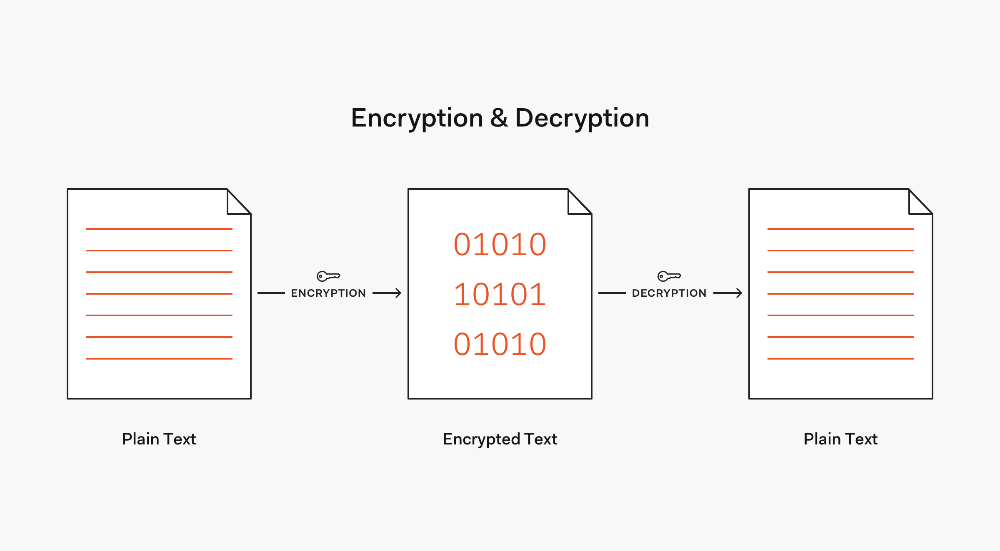
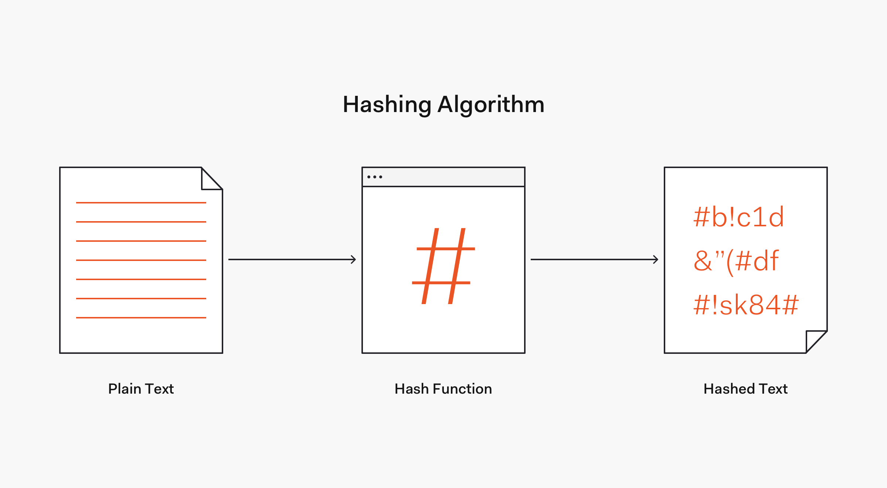
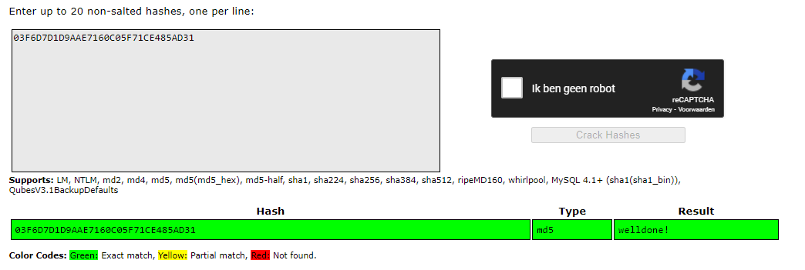
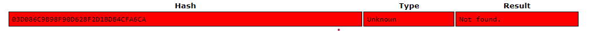
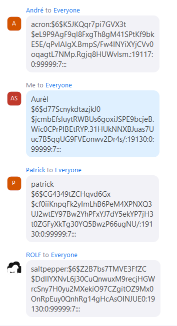

# [Passwords]
Get to know how passwords are encrypted and stored . 

## Key terminology
- hashing: a hash function takes an input string and gives an output hash of a fixed length (output is always the same length no matter how long the input is, the same function input always results in the same hash =  deterministic). Unlike encryption hashing is not a two-way process.
  - There are two types of one way hashing algorithms, fast and slow, fast is used for file verification and slow for password hashing.
  - The input of a one-way hashing algorithm cannot be determined by analysing the output or running it through another function.
  - When a hacker has a list of password hashes from a stolen database they work out what one-way hashing algorithm was used and then guess as many possible passwords as they can, when they have an output that matches an entry in the database they know that the input is the user’s password.
- Rainbow table: precomputed table for reversing hash functions; is build for unsalted hashes
- hash salting: when random data (a salt) is used as an additional input to a hash function that hashes a password. The goal of salting is to defend against dictionary attacks or attacks against hashed passwords using a rainbow table.
- brute force attack: input random passwords into the hash function until a match is found (largely inefficient)
- collision attack: attempt to find two pre-images that produce the same hash

## Exercise
1. Find out what hashing is and why it is preferred over symmetric encryption for storing passwords.
2. Find out how a Rainbow Table can be used to crack hashed passwords.
3. Below are two MD5 password hashes. One is a weak password, the other is a string of 16 randomly generated characters. Try to look up both hashes in a Rainbow Table.
03F6D7D1D9AAE7160C05F71CE485AD31
03D086C9B98F90D628F2D1BD84CFA6CA
4. Create a new user in Linux with the password 12345. Look up the hash in a Rainbow Table. Despite the bad password, and the fact that Linux uses common hashing algorithms, you won’t get a match in the Rainbow Table. This is because the password is salted. 

### Sources
- [Hashes vs Encryption](https://www.youtube.com/watch?v=9Jva1tSeAWk)
- [One way hashing](https://www.technipages.com/definition/one-way-hash-function#:~:text=A%20one%2Dway%20hash%20function,output%20hash%20is%20completely%20different.)
- [Rainbow table](https://www.youtube.com/watch?v=wlkNmdZ7cvY)

### Overcome challenges
[Give a short description of your challanges you encountered, and how you solved them.]

### Results
1. Hashes are non reversible unlike encryption, so it's safer for password storing and data integrity. Hashing transform passwords into data that can't be converted back to the original pw. 
   - Encryption/decryption
     - 
   - Hashing
     - 
2. A rainbow table has precomputed hash functions like MD5 or SHA256 which makes it fairly easy to crack unsalted hashed passwords. 
3. Used the crackstation.
- 
- 
4. Following screenshot shows our passwords in salted has form. 
