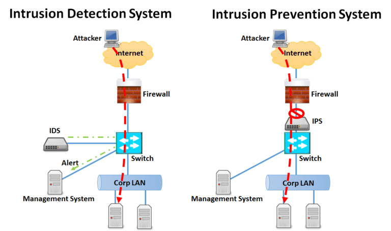
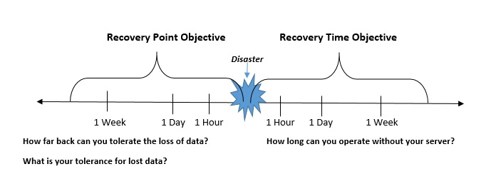

# [Detection, response and analysis]
Detecting threats, responding to it and how to analyze security processes. 

## Key terminology
- IDS: Intrusion detection system: **detects** attackers and network anomalies and sends alerts via email, text, etc. (alarm/alert)
- IPS: Intrusion preventive system: actively defends the network by **stopping** attacks and also performs IDS functions such as alerting 
  - 
- hack response strategies
  1.  Review risks and potential vulnerabilities in your business data
  2.  Establish a response team
  3.  Implement tools, services, and policies
  4.  Define workflows for identification, containment, and eradication
  5.  Outline a communications plan
  6.  Review data breach response plan execution
- systems hardening: hardening is used to set a baseline of requirements for each system.
  Each hardening standard may include requirements related but not limited to:

  - Physical security – setting environment controls around secure and controlled locations
  - Operating systems – ensuring patches are deployed and access to firmware is locked
  - Applications – establishing rules on installing software and default configurations
  - Security appliances – ensuring anti-virus is deployed and any end-point protections are reporting in appropriately
  - Networks and services – removing any unnecessary services (e.g., telnet, ftp) and enabling secure protocols (e.g., ssh, sftp)
  - System auditing and monitoring – enabling traceability and monitoring of events
  - Access control – ensuring default accounts are renamed or disabled
  - Data encryption – encryption ciphers to use (e.g., SHA-256)
  - Patching and updates – ensuring patches and updates are successfully being deployed
  - System backup – ensuring backups are properly configured
- disaster recovery plan: enables businesses to respond quickly to a disaster and take immediate action to reduce damage, and resume operations as quickly as possible. A disaster recovery plan typically includes:
  - Emergency procedures staff can carry out when a disaster occurs
  - Critical IT assets and their maximum allowed outage time
  - Tools or technologies that should be used for recovery
  - A disaster recovery team, their contact information and communication procedures (e.g. who should be notified in case of disaster)
- RPO: Recovery Point Objective (RPO) is a measure of how frequently you take backups. RPO represents how fresh recovered data will be. In practice, the RPO indicates the amount of data (updated or created) that will be lost or need to be reentered after an outage.
- RTO: Recovery Time Objective (RTO) is the amount of downtime a business can tolerate. The shorter the RTO = the higher the cost.
- cost in RTO: data, PR, financial
- 

## Exercise
- A Company makes daily backups of their database. The database is automatically recovered when a failure happens using the most recent available backup. The recovery happens on a different physical machine than the original database, and the entire process takes about 15 minutes. What is the RPO of the database?
- An automatic failover to a backup web server has been configured for a website. Because the backup has to be powered on first and has to pull the newest version of the website from GitHub, the process takes about 8 minutes. What is the RTO of the website?

### Sources
- [Network Intrusion Detection and Prevention](https://www.youtube.com/watch?v=hEgWPWIuq_s)
- [Incident response process](https://www.youtube.com/watch?v=qGktAVJpTGE)
- [Data breach response](https://spectralops.io/blog/6-steps-data-breach-response-plan/)
- [Hardening](https://www.packetlabs.net/posts/security-hardening-standards/#:~:text=A%20hardening%20standard%20is%20used,and%20applications%2C%20such%20as%20CIS.)
- [RTO and RPO](https://www.youtube.com/watch?v=wgvq9y8wwNQ)

### Overcome challenges
- Looked up key terminology. 

### Results
1. Recovery point of objective would be 15 minutes as it is stated in the question itself; 'the entire process', so that's the maximum time which the company will be down for. 
2. Recovery time objective is 8 minutes, because it takes 8 minutes to pull the newest version of concerning website.
