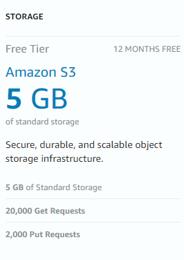
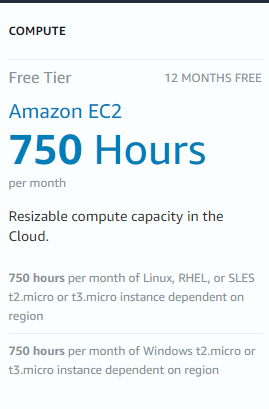
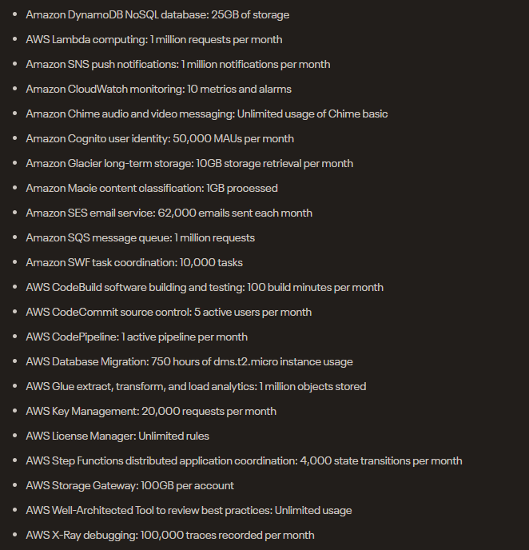
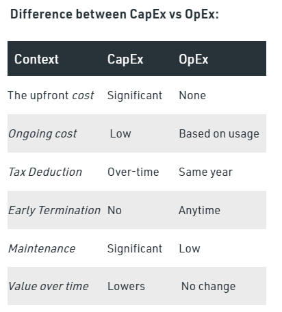

# [AWS Pricing]
Study AWS pricing model and shallow dive into the S3 and EC2 services.

## Key terminology
- **pay as you go model**: Only pay for what u use, helps anorganiazation remain agile, responsive and scalable. 
- **save when u commit**: Savings Plans is a flexible pricing model that provides significant savings on your AWS usage. This pricing model offers lower prices on AWS Compute and AWS Machine Learning. Savings Plans offer savings over On-Demand in exchange for a commitment to use a specific amount (measured in $/hour) of an AWS service or a category of services, for a one- or three-year period.
- **pay less by using more**: With AWS, you can get volume based discounts and realize important savings as your usage increases. For services such as S3, pricing is tiered, meaning the more you use, the less you pay per GB. AWS also gives you options to acquire services that help you address your business needs.
- **benefit from massive economies of scale**: Economy of scale is a term for something that is very expensive to make once, becoming cheap when per unit, if you can make a million of them in a factory. Another benefit of economy of scale is that Amazon can offer a manufacturer a guarantee that they will buy a million of something. This means that manufacturer can spend more money on their initial design of the product, and that they can make sure to make repair of that item easier. 
- **S3**: Amazon Simple Storage Service (Amazon S3) is an object storage service that offers industry-leading scalability, data availability, security, and performance. Customers of all sizes and industries can use Amazon S3 to store and protect any amount of data for a range of use cases, such as data lakes, websites, mobile applications, backup and restore, archive, enterprise applications, IoT devices, and big data analytics. Amazon S3 provides management features so that you can optimize, organize, and configure access to your data to meet your specific business, organizational, and compliance requirements
- **EC2**: Amazon Elastic Compute Cloud provides scalable computing capacity in the Amazon Web Services (AWS) Cloud. Using Amazon EC2 eliminates your need to invest in hardware up front, so you can develop and deploy applications faster. You can use Amazon EC2 to launch as many or as few virtual servers as you need, configure security and networking, and manage storage. Amazon EC2 enables you to scale up or down to handle changes in requirements or spikes in popularity, reducing your need to forecast traffic.
- **capex**: capital expenditure. Business expensens made up front in order to create long term benefits for the future. Specifically in IT this could mean hardware like servers, printers and scanners. Maintenance of particular hardware is also considered CapEx.
- **opex**: operational expenditure. Operating costs; the expenses to run day-to-day business such as services like website hosting or domain registrations. 

## Exercise
Study 
1. the four advantages of the AWS pricing model.
2. AWS free tier for:
   - S3
   - EC2
   - Always free services
3. Understand the differences between capex and opex

### Sources
- [Pricing](https://aws.amazon.com/pricing/)
- [Benefit from massive economies of scale](https://acloudguru.com/forums/aws-certified-cloud-practitioner/benefit-from-massive-economies-of-scale-can-someone-explain-this-to-me-in-more-detail-please)
- [AWS S3](https://www.youtube.com/watch?v=77lMCiiMilo)
- [AWS EC2](https://www.youtube.com/watch?v=TsRBftzZsQo)
- [Free tier services](https://aws.amazon.com/free/?all-free-tier.sort-by=item.additionalFields.SortRank&all-free-tier.sort-order=asc&awsf.Free%20Tier%20Types=tier%23always-free&awsf.Free%20Tier%20Categories=*all&awsm.page-all-free-tier=3)
- [Free tier services 2](https://capiche.com/q/what-does-the-aws-free-tier-include)
- [Free tier faqs](https://aws.amazon.com/free/free-tier-faqs/)
- [AWS Pricing Calculator tutorial](https://www.youtube.com/watch?v=JWz4eCczCkQ)
- [CapEx and OpEx](https://www.youtube.com/watch?v=dLplo_mPc1Q)

### Overcome challenges
- Looked up the pricing model
- Looked up the free tier, S3 and EC2 services
- Looked up capex and opex in Cloud Computing

### Results
1. Advantages of their pricing model:  
   - allows you to easily adapt to changing business needs without overcommitting budgets and improving your responsiveness to changes. With a pay as you go model, you can adapt your business depending on need and not on forecasts, reducing the risk or overprovisioning or missing capacity.
   - By paying for services on an as needed basis, you can redirect your focus to innovation and invention, reducing procurement complexity and enabling your business to be fully elastic.
   - volume based discounts and realize important savings as your usage increases
2. - S3 free tier 
      - 
   - EC2 free tier 
     - 
   - AWS free tier: 
     - 
3. - Capital Expenditure: It is the **initial spending of money (whole together) on physical infrastructure**, and then deducting that up-front expense over time. The up-front cost from CapEx has a value that reduces over time. All expenses incurred for long-term benefits in the future lie under CapEx.
- Operational Expenditure: It is like a pay-as-you-go service. You can deduct this expense in the same year you spend it. There is no up-front cost, as you pay for a **service or product** as you use it. It is as the name suggests, the expense of daily operation.
  - 

