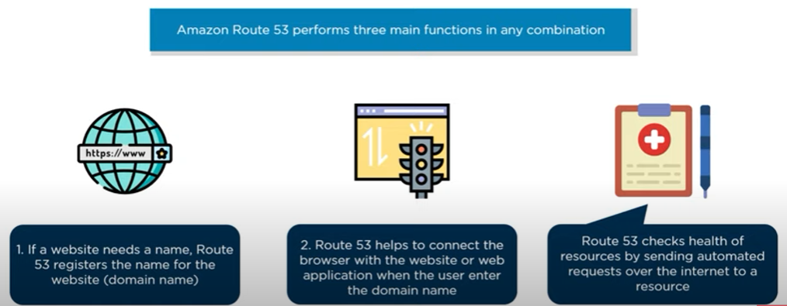
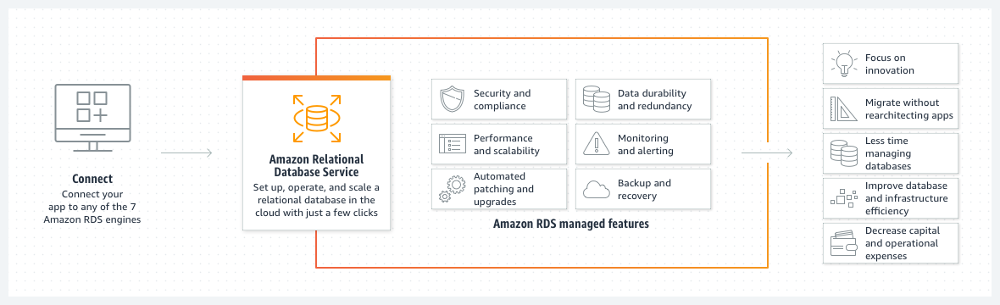
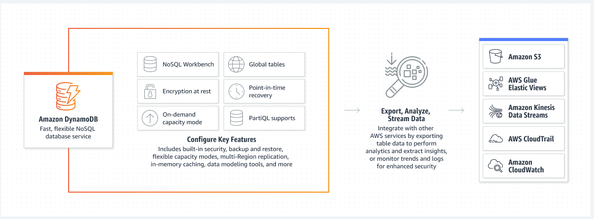
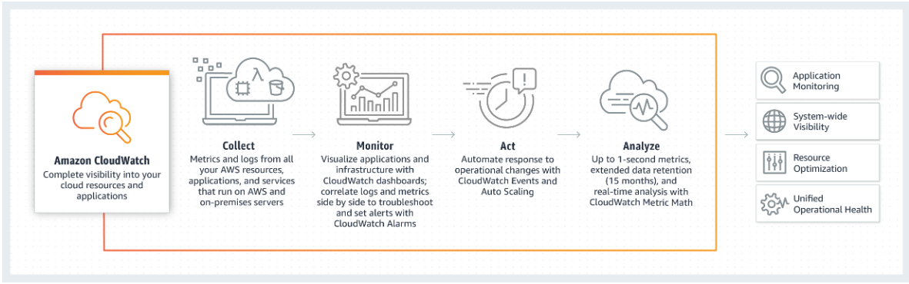
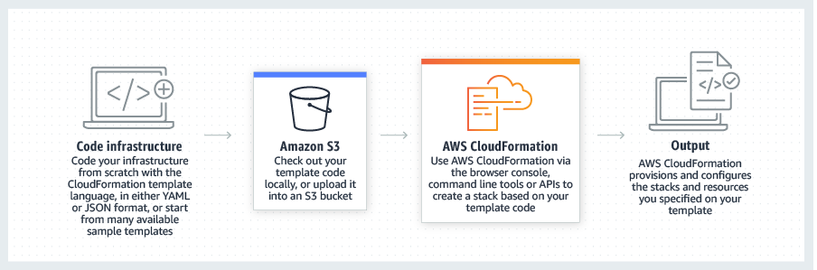
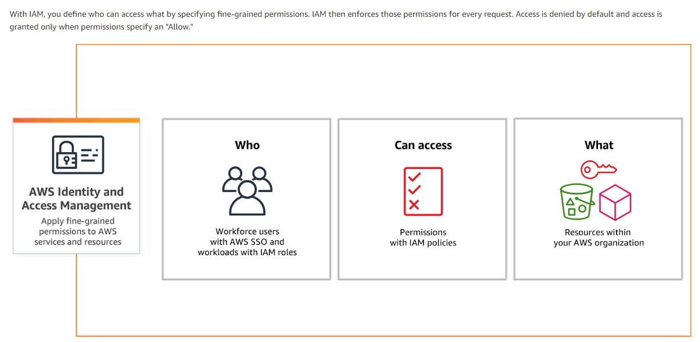

# [Core Services]
Prepare Knowledge for the Cloud practitioner exam.

## Key terminology
- **Amazon EC2**: Amazon Elastic Compute Cloud (Amazon EC2) offers the broadest and deepest compute platform, with over 500 instances and choice of the latest processor, storage, networking, operating system, and purchase model to help you best match the needs of your workload. 
- **AWS Lambda**: With AWS Lambda, you can run code without provisioning or managing servers. You pay only for the compute time that you consume—there's no charge when your code isn't running. You can run code for virtually any type of application or backend service—all with zero administration.
- **AWS Elastic Beanstalk**: AWS Elastic Beanstalk is an easy-to-use service for deploying and scaling web applications and services developed with Java, .NET, PHP, Node.js, Python, Ruby, Go, and Docker on familiar servers such as Apache, Nginx, Passenger, and IIS.
- **Amazon VPC**: Virtual Private Cloud. A private section ow AWS where AWS resources can be stored with types of permissions (security) on top of them.
- **Amazon Route 53**:  Amazon Route 53 is a highly available and scalable cloud Domain Name System (DNS) web service. It is designed to give developers and businesses an extremely reliable and cost effective way to route end users to Internet applications by translating names like www.example.com into the numeric IP addresses like 192.0.2.1 that computers use to connect to each other. 
- **Amazon S3**: Simple Storage Solution is an object storage service offering industry-leading scalability, data availability, security, and performance. Cheap, reliable way to store objects. Low Latency and can easily be used to host static websites. Has a mechanism to shift away old data into long term storage for cost reduction. 
- **Amazon S3 Glacier**: The Amazon S3 Glacier storage classes are purpose-built for data archiving, providing you with the highest performance, most retrieval flexibility, and the lowest cost archive storage in the cloud. All S3 Glacier storage classes provide virtually unlimited scalability and are designed for 99.999999999% (11 nines) of data durability.
- **Amazon CloudFront**: Amazon CloudFront is a web service that speeds up distribution of your static and dynamic web content, such as .html, .css, .js, and image files, to your users. CloudFront delivers your content through a worldwide network of data centers called edge locations. 
- **Amazon RDS**: Amazon Relational Database Service (RDS) is a collection of managed services that makes it simple to set up, operate, and scale databases in the cloud. Choose from seven popular engines — Amazon Aurora with MySQL compatibility, Amazon Aurora with PostgreSQL compatibility, MySQL, MariaDB, PostgreSQL, Oracle, and SQL Server — and deploy on-premises with Amazon RDS on AWS Outposts.
- 
- **Amazon DynamoDB**: Amazon DynamoDB is a fully managed, serverless, key-value NoSQL database designed to run high-performance applications at any scale. DynamoDB offers built-in security, continuous backups, automated multi-Region replication, in-memory caching, and data export tools. 
- **Amazon CloudWatch**: Amazon CloudWatch is a monitoring and observability service built for DevOps engineers, developers, site reliability engineers (SREs), IT managers, and product owners. CloudWatch provides you with data and actionable insights to monitor your applications, respond to system-wide performance changes, and optimize resource utilization. CloudWatch collects monitoring and operational data in the form of logs, metrics, and events. 
- 
- **Amazon CloudFormation**: AWS CloudFormation lets you model, provision, and manage AWS and third-party resources by treating infrastructure as code. 
- **AWS Identity and Access Management**: AWS Identity and Access Management (IAM) provides fine-grained access control across all of AWS. With IAM, you can specify who can access which services and resources, and under which conditions. With IAM policies, you manage permissions to your workforce and systems to ensure least-privilege permissions.

## Exercise

### Sources
- [Lambda](https://docs.aws.amazon.com/lambda/latest/dg/welcome.html)
- [Lambda](https://www.youtube.com/watch?v=eOBq__h4OJ4)
- [Beanstalk](https://www.youtube.com/watch?v=uiM1xzOX8Qg)
- [Beanstalk](https://aws.amazon.com/elasticbeanstalk/)
- [VPC](https://www.youtube.com/watch?v=_V3dqC80FHU)
- [VPC](https://docs.aws.amazon.com/vpc/latest/userguide/what-is-amazon-vpc.html)
- [Route 53](https://www.youtube.com/watch?v=BtiS0QyiTK8)
- [Route 53](https://aws.amazon.com/route53/)
- [S3](https://www.youtube.com/watch?v=L3dYocCSU-E)
- [S3](https://aws.amazon.com/s3/)
- [Glacier](https://www.youtube.com/watch?v=EKaJENJqD8E)
- [Glacier](https://docs.aws.amazon.com/amazonglacier/latest/dev/introduction.html)
- [Cloudfront](https://www.youtube.com/watch?v=AT-nHW3_SVI)
- [RDS](https://aws.amazon.com/rds/)
- [DynamoDB](https://aws.amazon.com/dynamodb/)
- [IAM](https://aws.amazon.com/iam/)

### Overcome challenges
- Looked up key terminology and defy urge of sleep and feeling of drowsiness. 

### Results
See key terminology.
