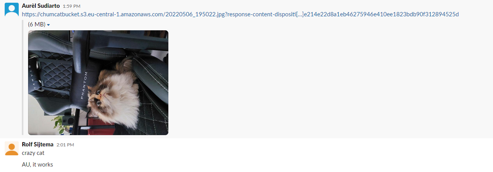

# [S3]
Learn about S3 and how to publish on it. 

Amazon Simple Storage Service (Amazon S3) is an object storage service offering industry-leading scalability, data availability, security, and performance. Customers of all sizes and industries can store and protect any amount of data for virtually any use case, such as data lakes, cloud-native applications, and mobile apps. With cost-effective storage classes and easy-to-use management features, you can optimize costs, organize data, and configure fine-tuned access controls to meet specific business, organizational, and compliance requirements.
 
 
 

## Key terminology
There are 4 storage classes:
- **S3 Standard** : S3 Standard is appropriate for a wide variety of use cases, including cloud applications, dynamic websites, content distribution, mobile and gaming applications, and big data analytics
- **S3 Standard-IA** : S3 Standard-IA is for data that is accessed less frequently, but requires rapid access when needed. S3 Standard-IA offers the high durability, high throughput, and low latency of S3 Standard, with a low per GB storage price and per GB retrieval charge. This combination of low cost and high performance make S3 Standard-IA ideal for long-term storage, backups, and as a data store for disaster recovery files.
- **S3 One-zone IA** : S3 One Zone-IA is for data that is accessed less frequently, but requires rapid access when needed. Unlike other S3 Storage Classes which store data in a minimum of three Availability Zones (AZs), S3 One Zone-IA stores data in a single AZ and costs 20% less than S3 Standard-IA. S3 One Zone-IA is ideal for customers who want a lower-cost option for infrequently accessed data but do not require the availability and resilience of S3 Standard or S3 Standard-IA. It’s a good choice for storing secondary backup copies of on-premises data or easily re-creatable data.
- **S3 Glacier** : The Amazon S3 Glacier storage classes are purpose-built for data archiving, providing you with the highest performance, most retrieval flexibility, and the lowest cost archive storage in the cloud. All S3 Glacier storage classes provide virtually unlimited scalability and are designed for 99.999999999% (11 nines) of data durability. The S3 Glacier storage classes deliver options for the fastest access to your archive data and the lowest-cost archive storage in the cloud.

## Exercise 1

1. Create new S3 bucket with the following requirements:
Region: Frankfurt (eu-central-1)
2. Upload a cat picture to your bucket.
3. Share the object URL of your cat picture with a peer. Make sure they are able to see the picture.

## Exercise 2
1. Create new bucket with the following requirements:
Region: Frankfurt (eu-central-1)
2. Upload the four files that make up AWS’ demo website.
3. Enable static website hosting.
4. Share the bucket website endpoint with a peer. Make sure they are able to see the website.

### Sources
- [Storage classes S3](https://aws.amazon.com/s3/storage-classes/)
- [Enabling website hosting](https://docs.aws.amazon.com/AmazonS3/latest/userguide/EnableWebsiteHosting.html)
- [How to host a website using S3](https://www.youtube.com/watch?v=-mIANj3lBFk)

### Overcome challenges
- Looked up the storage classes of the S3
- Looked up how to use S3 buckets for static website hosting 
  

## Results
### Exercise 1
Created a S3 bucket with a picture of my cat and published it.  
   - Made a bucket for my picture. 
   - Confirmation from my fellow students 
### Exercise 2
 Steps to get website online:
   -  Make bucket
   -  Bucket  for website hosting
      -  
   -  Enable public access
      -  
   -  Enable ACL
      -  
   -  Publish by ACL
      -  
   - Here's the static website 