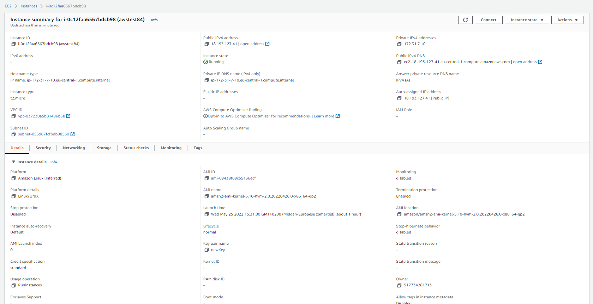
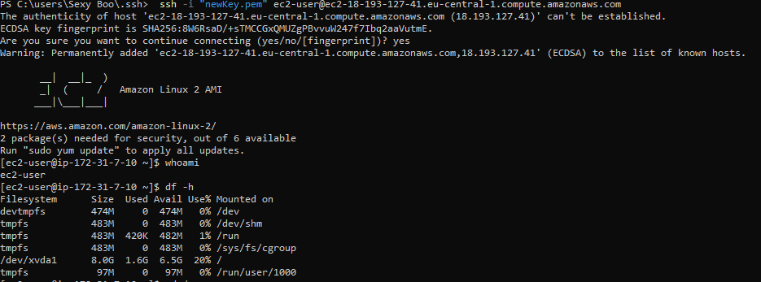
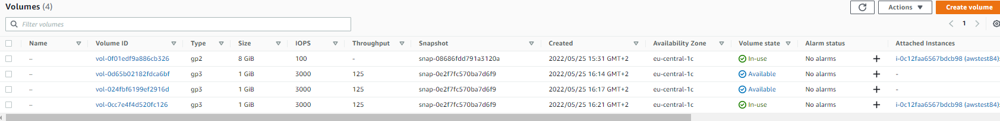
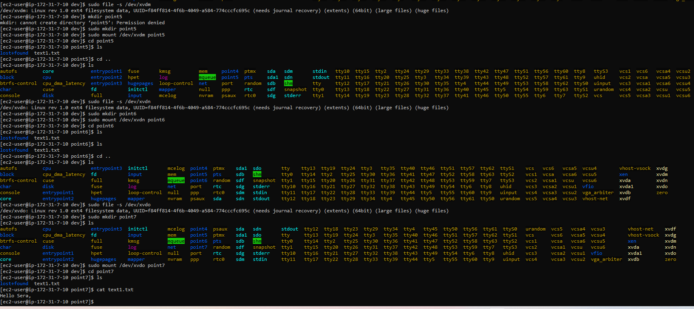
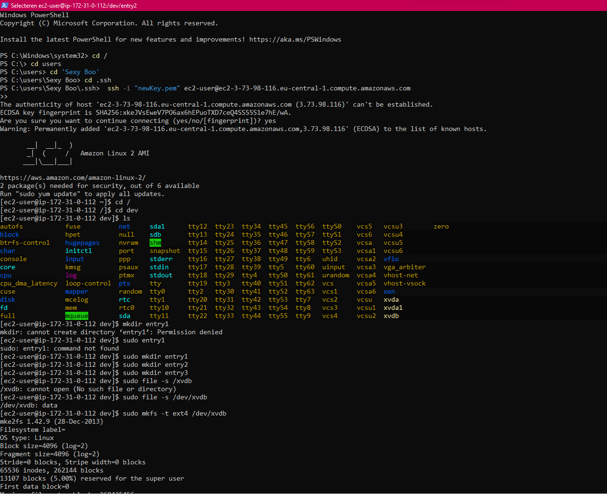
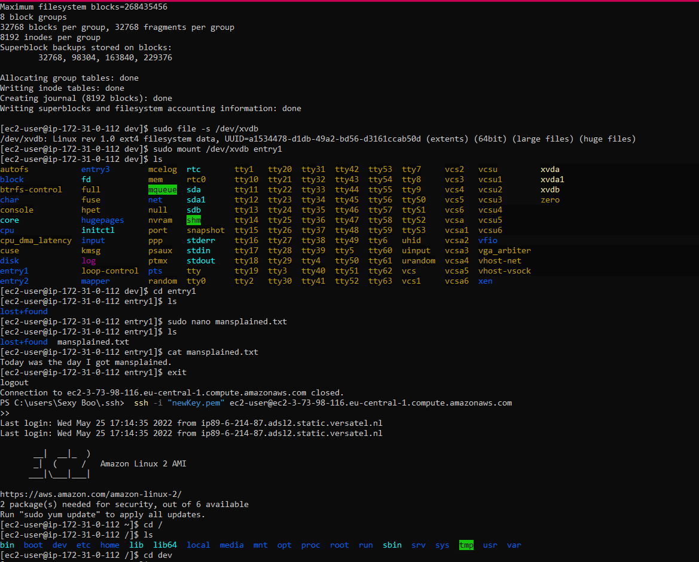
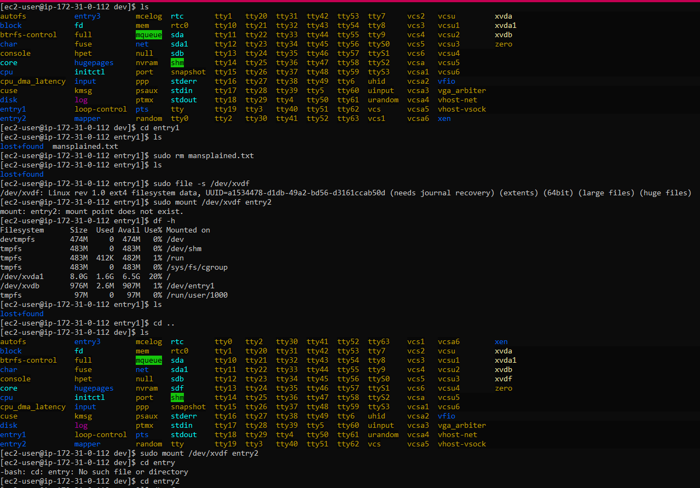
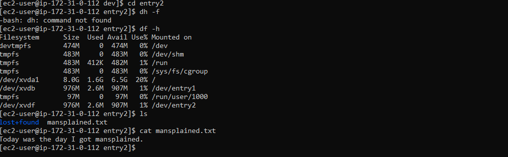

# [EBS]
Amazon Elastic Block Store (Amazon EBS) provides block level storage volumes for use with EC2 instances. EBS volumes behave like raw, unformatted block devices. You can mount these volumes as devices on your instances. EBS volumes that are attached to an instance are exposed as storage volumes that persist independently from the life of the instance. You can create a file system on top of these volumes, or use them in any way you would use a block device (such as a hard drive). You can dynamically change the configuration of a volume attached to an instance.

## Key terminology
- lsblk: Lsblk is used to display details about block devices and these block devices(Except ram disk) are basically those files that represent devices connected to the pc. 
- sudo file -s 'path': Check if the volume has any data
- sudo mkfs -t ext4 'path':Format the volume to the ext4 filesystem
- sudo mount 'path' 'foldername': mount the volume directory
- df -h: The ‘df‘ command stands for “disk filesystem“, it is used to get a full summary of available and used disk space usage of the file system on the Linux system.
Using ‘-h‘ parameter with (df -h) will show the file system disk space statistics in “human-readable” format, means it gives the details in bytes, megabytes, and gigabyte.

## Exercise 1
- Navigate to the EC2 menu.
- Create a t2.micro Amazon Linux 2 machine with all the default - settings.
- Create a new EBS volume with the following requirements:
  - Volume type: General Purpose SSD (gp3)
  - Size: 1 GiB
  - Availability Zone: same as your EC2
- Wait for its state to be available.

## Exercise 2
- Attach your new EBS volume to your EC2 instance.
- Connect to your EC2 instance using SSH.
- Mount the EBS volume on your instance.
- Create a text file and write it to the mounted EBS volume.

## Exercise 3
- Create a snapshot of your EBS volume.
- Remove the text file from your original EBS volume.
- Create a new volume using your snapshot.
- Detach your original EBS volume.
- Attach the new volume to your EC2 and mount it.
- Find your text file on the new EBS volume.

### Sources
- [How to mount](https://devopscube.com/mount-ebs-volume-ec2-instance/)
- Killian

### Overcome challenges
- Looked up how to mount
- Making a volume by a snapshot didn't work for like 8 times and then it did worked for no obvious reason (corrected: I was too fast/impatient and should've waited untill my new volume was attached :'))

### Results
1. Made instance
      -  
2. Login with SSH
      - 
3. Several volumes, attached and detached, made from snapshot.  
3. Did several mounts on volumes from 1 snapshot, because the first 5 times did not work. I became obsessed.  
      -   

Tried everything in 1 quick breath later in the evening: 
- Behold my clean result:
  - 
  - 
  - 
  - 