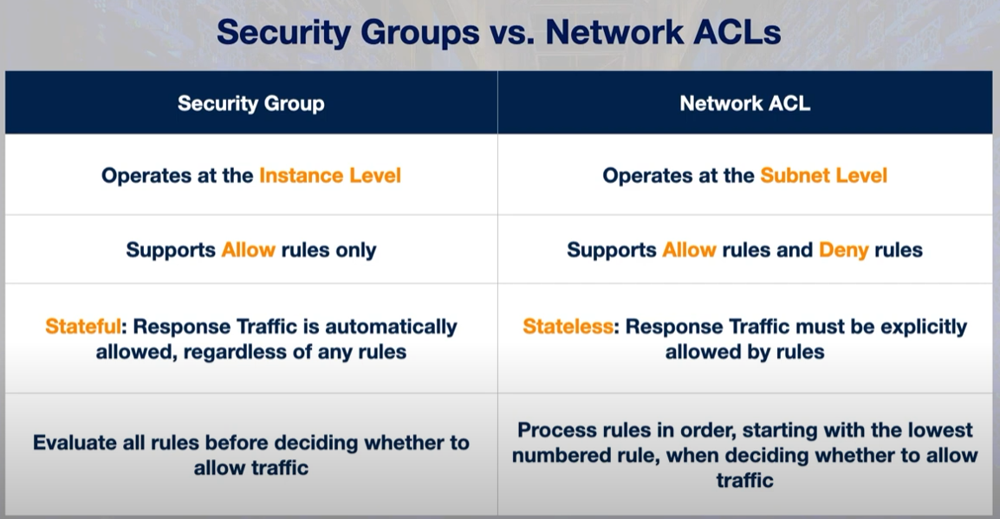

# [Security groups]
Study about security groups and network access control lists. 

## Key terminology
- **Security Groups**: In AWS, a security group controls traffic to or from an EC2 instance according to a set of inbound and outbound rules. This means it represents instance-level (NIC) security. For example, an inbound rule might allow traffic from a single IP address to access the instance, while an outbound rule might allow all traffic to leave the instance.

    Because security groups function at the instance level of a VPC, each security group can be applied to one or more instances, even across subnets. And each instance is required to be associated with one or more security groups.

- **Network access control lists**: In AWS, a network ACL (or NACL) controls traffic to or from a subnet according to a set of inbound and outbound rules. This means it represents network level security. For example, an inbound rule might deny incoming traffic from a range of IP addresses, while an outbound rule might allow all traffic to leave the subnet.

    Because NACLs function at the subnet level of a VPC, each NACL can be applied to one or more subnets, but each subnet is required to be associated with only one NACL.

- **VPC flow logs**: enables you to capture information about the IP traffic going to and from network interfaces in a VPC

## Exercise
Study Security Groups and Network Access Control Lists in AWS

### Sources
- [Security groups](https://www.youtube.com/watch?v=00uUXZ9oPec)
- [Security Groups vs Network ACL's](https://www.youtube.com/watch?v=ttc0b2NZTV0)
- [EC2 instances with security groups](https://www.youtube.com/watch?v=Z973mNYD3xg)

### Overcome challenges
- Looked up key terminology

### Results
See key terminology.

- When traffic enters your network, it is filtered by NACLs before it is filtered by security groups. Security groups are a required form of defense for instances, because an instance must be associated with at least one security group. 

- Differences 
