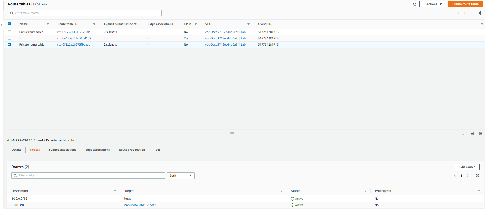
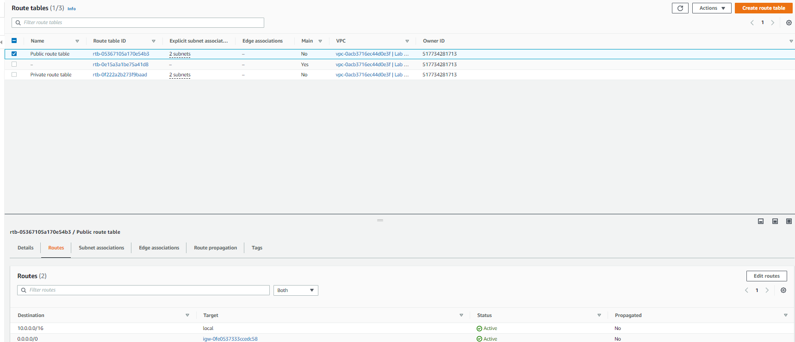
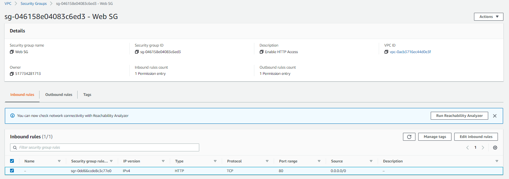
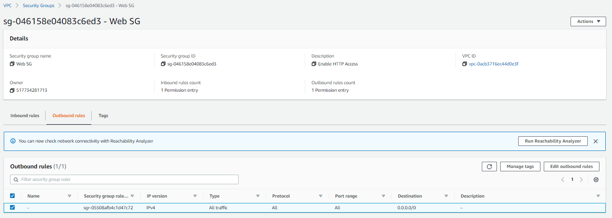
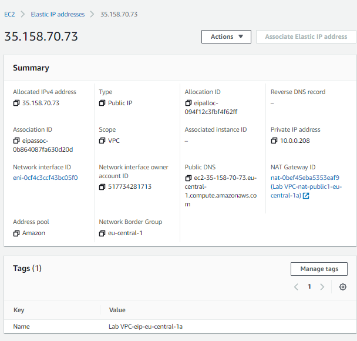
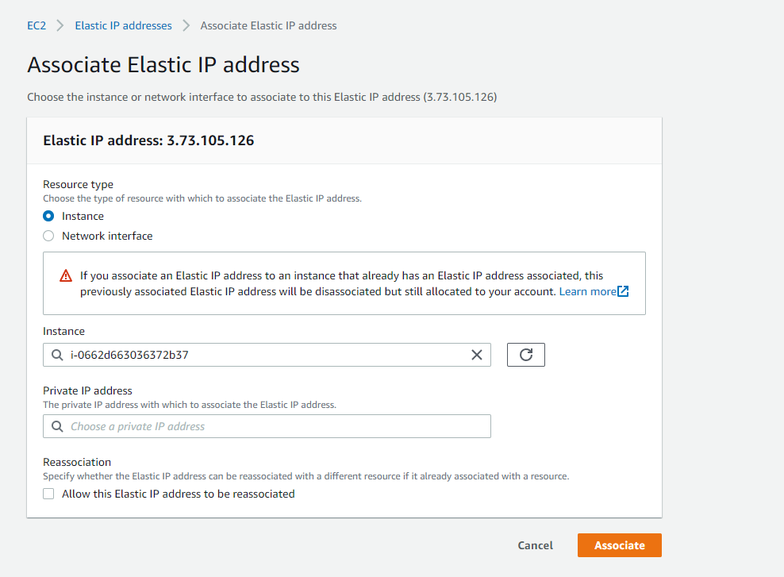
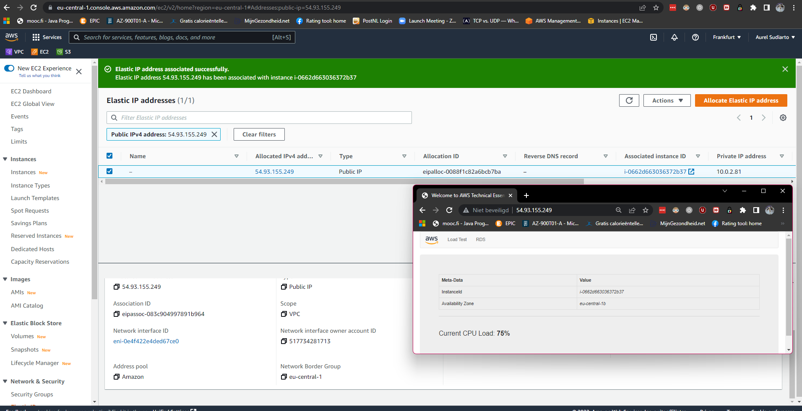

# [VPC] 
Amazon VPC is typically described as a virtual private data center in the cloud. It is a virtual network that is logically isolated from other VPCs.
With a VPC you have full control over the design of the network. You can create subnets, internet gateways (igw), NAT gateways, VPN connections, and more.

## Key terminology
- **VPC**: virtual networking environment, including resource placement, connectivity, and security
- **NAT-gateway**: A NAT gateway is a Network Address Translation (NAT) service. You can use a NAT gateway so that instances in a private subnet can connect to services outside your VPC but external services cannot initiate a connection with those instances.
- **route table**: Your VPC has an implicit router, and you use route tables to control where network traffic is directed. Each subnet in your VPC must be associated with a route table, which controls the routing for the subnet (subnet route table).
- **Elastic IP adress**: An Elastic IP address is a reserved public IP address that you can assign to any EC2 instance in a particular region, until you choose to release it. To allocate an Elastic IP address to your account in a particular region, see Allocate an Elastic IP address.

## Exercise 1
Allocate an Elastic IP address to your account.
Use the Launch VPC Wizard option to create a new VPC with the following requirements:
Region: Frankfurt (eu-central-1)
VPC with a public and a private subnet
Name: Lab VPC
CIDR: 10.0.0.0/16
Requirements for the public subnet:
Name: Public subnet 1
CIDR: 10.0.0.0/24
AZ: eu-central-1a
Requirements for the private subnet:
Name: Private subnet 1
CIDR: 10.0.1.0/24
AZ: eu-central-1a
    
Your network should now look like this:

## Exercise 2
  - Create an additional public subnet without using the wizard with the following requirements:
    -  VPC: Lab VPC
    -  Name: Public Subnet 2
    -  AZ: eu-central-1b
    -  CIDR: 10.0.2.0/24
- Create an additional private subnet without using the wizard with the following requirements:
    -  VPC: Lab VPC
    -  Name: Private Subnet 2
    -  AZ: eu-central-1b
    -  CIDR: 10.0.3.0/24
- View the main route table for Lab VPC. It should have an entry for the NAT gateway. Rename this route table to Private Route Table.
- Explicitly associate the private route table with your two private subnets.
- View the other route table for Lab VPC. It should have an entry for the internet gateway. Rename this route table to Public Route Table.
- Explicitly associate the public route table to your two public subnets.
  
## Exercise 3
- Create a Security Group with the following requirements:
    -   Name: Web SG
    -   Description: Enable HTTP Access
    -   VPC: Lab VPC
    -   Inbound rule: allow HTTP access from anywhere
    -   Outbound rule: Allow all traffic

## Exercise 4
- Launch an EC2 instance with the following requirements:
    -  AMI: Amazon Linux 2
    -  Type: t3.micro
    -  Subnet: Public subnet 2
    -  Auto-assign Public IP: Enable
    -  User data:
        -   #!/bin/bash
        -     Install Apache Web Server and PHP
        -   yum install -y httpd mysql php
        -     Download Lab files
        -   wget https://aws-tc-largeobjects.s3.amazonaws.com/CUR-TF-100-RESTRT-1/      -   80-lab-vpc-web-server/lab-app.zip
        -   unzip lab-app.zip -d /var/www/html/
        -     Turn on web server
        -   chkconfig httpd on
        -   service httpd start
    -  Tag:
    - Key: Name
    - Value: Web server
    Security Group: Web SG
    Key pair: no key pair
Connect to your server using the public IPv4 DNS name.

### Sources
- [EIP AWS](https://docs.aws.amazon.com/AWSEC2/latest/UserGuide/elastic-ip-addresses-eip.html)
- [Add AZ](https://docs.aws.amazon.com/autoscaling/ec2/userguide/as-add-availability-zone.html)
- Killian 

### Overcome challenges
- Went my way with the wizard and clicked on some key terms on the left side of the dashboard. All came out pretty good, trial and error. 

### Results
1. Settings for the VPC in exercise 1
    - 
2. Created extra subnets without using the VPC wizard and added them to assigned route tables
    - 
    - 
3. Created new Security Group
    - Inbound rules
    - Outbound rules
4. - 
   - 
   -  
   
   
