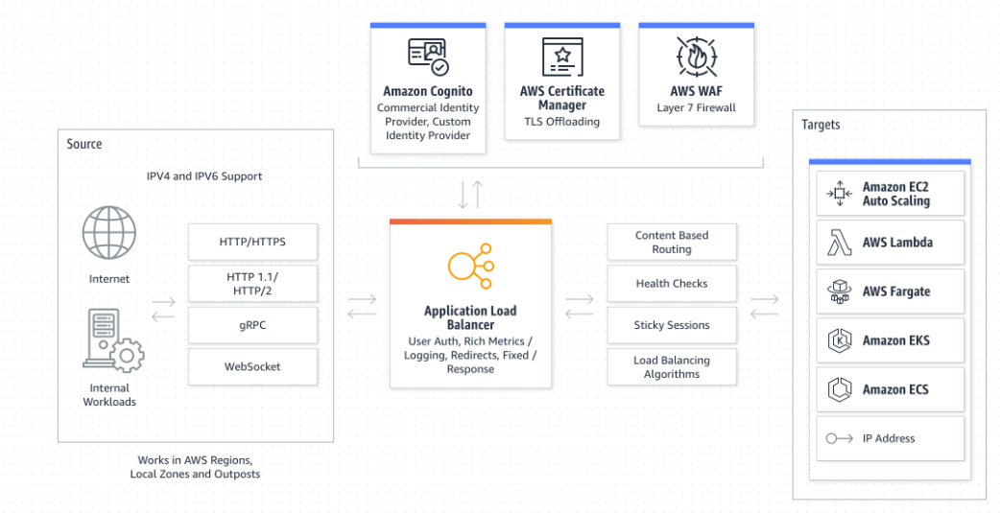

# [ELB & Auto Scaling]]
[Give a short summary of the subject matter.]

## Key terminology
- **Elastic load balancing**: automatically distributes incoming application traffic across multiple targets and virtual appliances in one or more Availability Zones (AZs).
- **auto scaling**: cloud computing technique for dynamically allocating computational resources. Depending on the load to a server farm, the number of servers that are active will typically vary automatically as user needs fluctuate. 
  - Auto scaling and load balancing are related because an application typically scales based on load balancing serving capacity. In other words, the serving capacity of the load balancer is one of several metrics (including cloud monitoring metrics and CPU utilization) that shapes the auto scaling policy.

- **Cloudwatch**: CloudWatch collects monitoring and operational data in the form of logs, metrics, and events, and visualizes it using automated dashboards so you can get a unified view of your AWS resources, applications, and services that run on AWS and on premises. 
- **types of load balancers**:
  - Application Load Balancer: this ELB works using HTTP and HTTPS protocols (layer 7 of the OSI stack). 
  - Network Load Balancer: this ELB works using TCP and UDP (layer 4 of the OSI stack). 
  - Gateway Load Balancer: this ELB acts as a gateway into your network, as well as a load balancer. It will first route traffic to a (3rd party) application that checks the traffic, like an IDS/IPS or Firewall. After the packet has been inspected, the GWLB acts like a NLB routing to your application. GWLB act on layers 3 and 4 of the OSI stack. 
  - Classic Load Balancer: this ELB is outdated and not recommended for use. AWS has (so far) never stopped supporting any services. The reason for this is that it can harm existing applications.

## Exercise 1
- Launch an EC2 instance with the following requirements:
    -   Region: Frankfurt (eu-central-1)
    -   AMI: Amazon Linux 2
    -   Type: t3.micro
    -   User data:
          -   #!/bin/bash
          -   #Install Apache Web Server and PHP
          -   yum install -y httpd mysql php
          -   #Download Lab files
          -   wget https://aws-tc-largeobjects.s3.amazonaws.com/CUR-TF-100-RESTRT-1/-     80-lab-vpc-web-server/lab-app.zip
          -   unzip lab-app.zip -d /var/www/html/
          -   #Turn on web server
          -   chkconfig httpd on
          -   service httpd start
    -   Security Group: Allow HTTP
-   Wait for the status checks to pass.
-   Create an AMI from your instance with the following requirements:
-   Image name: Web server AMI    

## Exercise 2
 Create an application load balancer with the following requirements:
    -  Name: LabELB
    -  Listener: HTTP on port 80
    -  AZs: eu-central-1a and eu-central-1b
    -  Subnets: must be public
    -  Security Group: 
       -  Name: ELB SG
       -  Rules: allow HTTP access
    -  Target Group:
       -  Name: LabTargetGroup
       -  Targets: to be registered by Auto Scaling
  
## Exercise 3
- Create a launch configuration for the Auto Scaling group. It has to be identical to the server that is currently running.
- Create an auto scaling group with the following requirements:
    - Name: Lab ASG
    - Launch Configuration: Web server launch configuration
    - Subnets: must be in eu-central-1a and eu-central-1b
    - Load Balancer: LabELB
    - Group metrics collection in CloudWatch must be enabled
    - Group Size:
      - Desired Capacity: 2
      - Minimum Capacity: 2
      - Maximum Capacity: 4
    - Scaling policy: Target tracking with a target of 60% average CPU utilisation

## Exercise 4
- Verify that the EC2 instances are online and that they are part of the target group for the load balancer.
 - Access the server via the ELB by using the DNS name of the ELB.
 - Perform a load test on your server(s) using the website on your server to activate auto scaling. There might be a delay on the creation of new servers in your fleet, depending on the settings on your Auto Scaling Group.

### Sources
- [Elastic load balancing](https://aws.amazon.com/elasticloadbalancing/)
- [Cloudwatch](https://aws.amazon.com/cloudwatch/)

### Overcome challenges
- Looked up terminology

### Results
1. 
2. 
3. 
4. 
