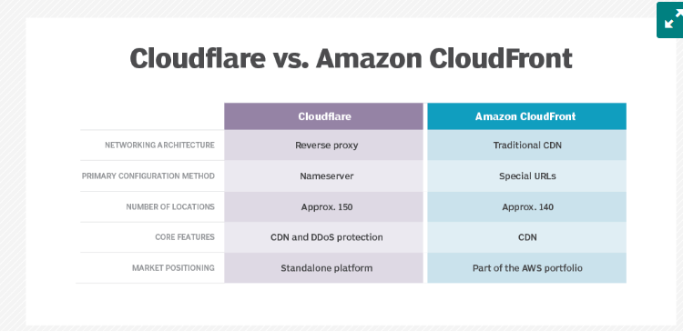
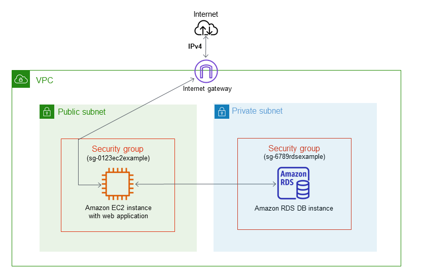
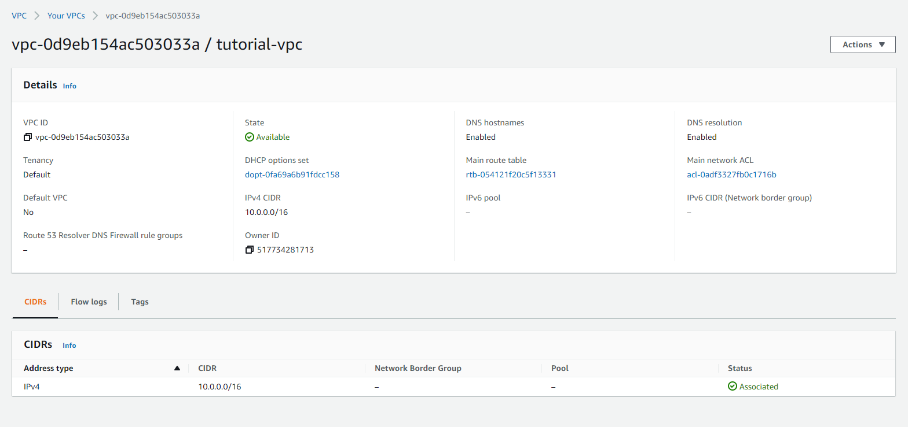
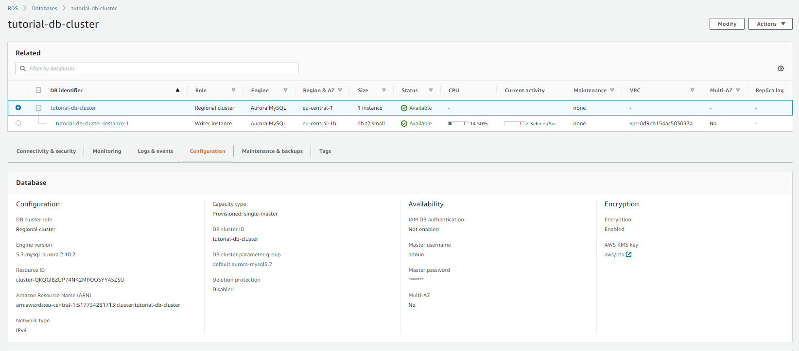
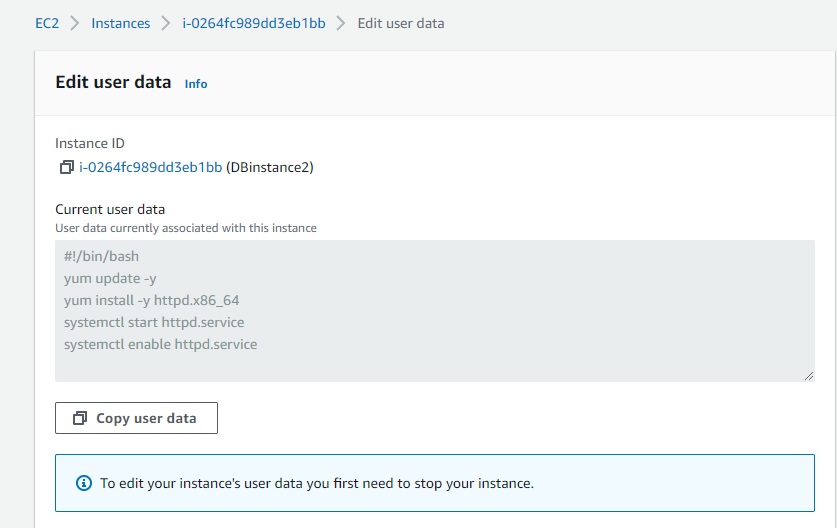
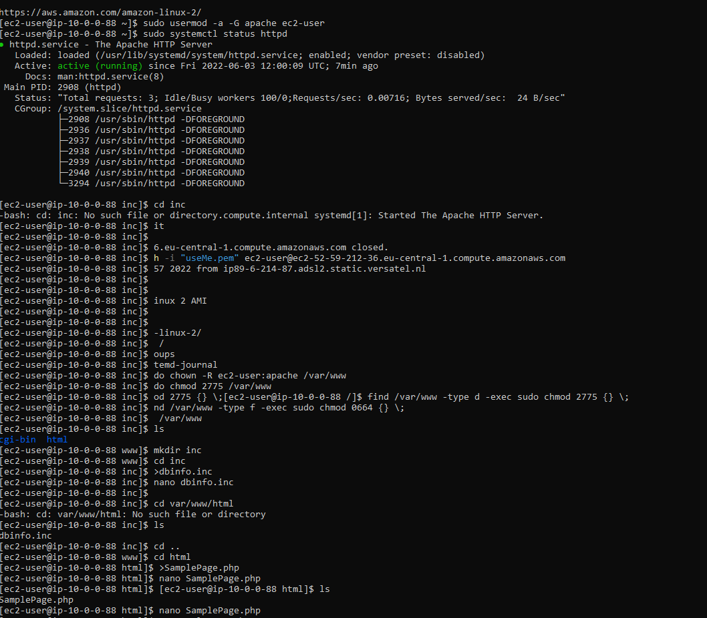
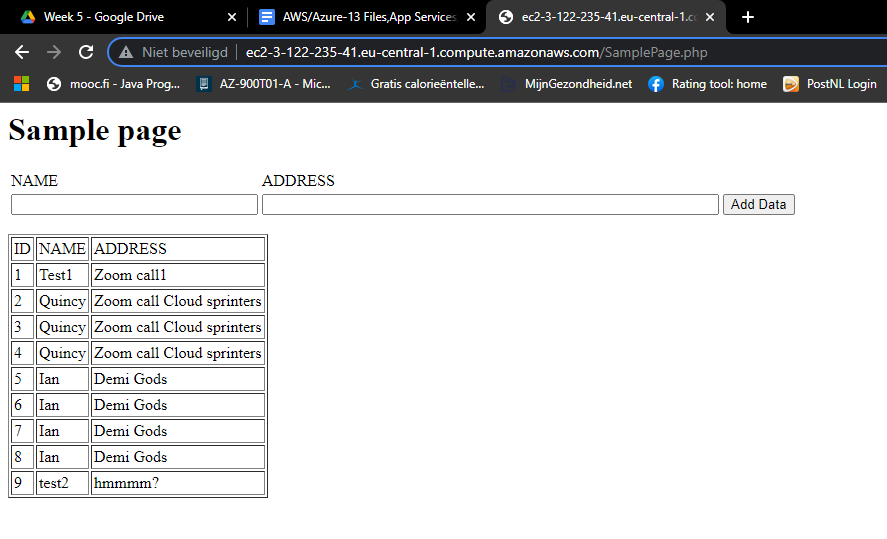
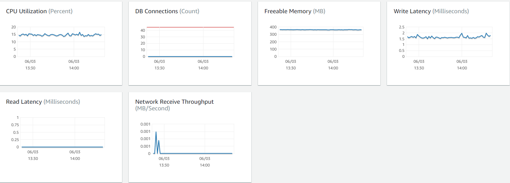

# [Elastic Beanstalk, Cloudfront, Route53, Elastic File System, RDS/Aurora]
Theoretical part: Elastic Beanstalk, cloudfront and Route53; usage and their combo's with other AWS services.
Practical part: EFS, connect via instance. RDS/Aurora: Create a webserver and make a connection to the RDS database.  

## Key terminology
- CDN: A content delivery network refers to a geographically distributed group of servers which work together to provide fast delivery of Internet content. A CDN allows for the quick transfer of assets needed for loading Internet content.
-  EFS: Amazon Elastic File System (Amazon EFS) automatically grows and shrinks as you add and remove files with no need for management or provisioning.
- RDS: Amazon Relational Database Service (RDS) is a collection of managed services that makes it simple to set up, operate, and scale databases in the cloud. Choose from seven popular engines
- Aurora: Amazon Aurora is a relational database management system (RDBMS) built for the cloud with full MySQL and PostgreSQL compatibility. 
- Differences between RDS and Aurora
  - Amazon RDS for PostgreSQL supports up to 64 TiB of storage and recent PostgreSQL versions.

  - DB instances for Amazon RDS for PostgreSQL use Amazon Elastic Block Store (Amazon EBS) volumes for database and log storage.

  - Aurora PostgreSQL uses a high-performance storage subsystem customized to take advantage of fast distributed storage. The underlying storage grows automatically in chunks of 10 GiB, up to 128 TiB. Aurora improves upon PostgreSQL for massive throughput and highly concurrent workloads. The combination of PostgreSQL compatibility with Aurora enterprise database capabilities provides an ideal target for commercial database migrations.
  - 

Database services by AWS

## Exercise
Study:
- Elastic Beanstalk
- Cloudfront 
- Route 53

### Sources
- [CDN](https://www.cloudflare.com/learning/cdn/what-is-a-cdn/)
- [RDS](https://aws.amazon.com/rds/)
- [Aurora](https://aws.amazon.com/rds/aurora/)
- [Aurora - RDS](https://www.youtube.com/watch?v=yHCwjAbwS6M)
- [Differences RDS and Aurora](https://aws.amazon.com/blogs/database/is-amazon-rds-for-postgresql-or-amazon-aurora-postgresql-a-better-choice-for-me/)
- [Elastic Beanstalk](https://docs.aws.amazon.com/elasticbeanstalk/latest/dg/Welcome.html)
- [EB - ](https://tutorialsdojo.com/elastic-beanstalk-vs-cloudformation-vs-opsworks-vs-codedeploy/)
- [Alternatives to EB](https://www.g2.com/products/aws-elastic-beanstalk/competitors/alternatives)
- [AWS CloudFront](https://docs.aws.amazon.com/AmazonCloudFront/latest/DeveloperGuide/Introduction.html)
- [Alternatives to Cloudfront](https://stackshare.io/amazon-cloudfront/alternatives)
- [Route53](https://aws.amazon.com/route53/)
- [Alternatives to Route53](https://www.g2.com/products/amazon-route-53/competitors/alternatives)
- [Aurora Serverless tutorial](https://www.youtube.com/watch?v=ciRbXZqBl7M)

### Overcome challenges
- Looked up the key terminology and AWS services
- Did not really know where to start with practical due to the new way of getting assignments which is to enhance the self-learning ability. 
 
  

# Theory
## Elastic Beanstalk
1. Utility:  
   Elastic Beanstalk is a platform within AWS that is used for deploying and scaling web applications. In simple terms this platform as a service (PaaS) takes your application code and deploys it while provisioning the supporting architecture and compute resources required for your code to run.

2. Replacement in classical setting:  
   Elastic Beanstalk provisions and operates the infrastructure and manages the application stack (platform) for you, so you don't have to spend the time or develop the expertise. It will also keep the underlying platform running your application up-to-date with the latest patches and updates.

3. How to combine with other services: 
  With AWS Elastic Beanstalk, you can:  
    -  Select the operating system that matches your application requirements (e.g., Amazon Linux or Windows Server 2016)
    -  Choose from several Amazon EC2 instances including On-Demand, Reserved instances, and Spot instances 
    -  Choose from several available database and storage options
    -  Enable login access to Amazon EC2 instances for immediate and direct troubleshooting
    -  Quickly improve application reliability by running in more than one Availability Zone
    -  Enhance application security by enabling HTTPS protocol on the load balancer
    -  Access built-in Amazon CloudWatch monitoring and getting notifications on application health and other important events
    -  Adjust application server settings (e.g., JVM settings) and pass environment variables
    -  Run other application components, such as a memory caching service, side-by-side in Amazon EC2
    -  Access log files without logging in to the application servers

4. Differences with similar services:  
Inside AWS it would be Beanstalk vs Cloudformation:
The essential difference between these services is that Beanstalk handles deployment/provisioning for you while CloudFormation requires a lot of input. 

   Most other PaaS-solutions do not offer the flexibility and control that Elastic Beanstalk facilitates. Flexibility and control for developers are predetermined by the vendor, with set infrastructure (on all or some parts). With AWS EB developers retain full control over AWS resources and they could manage severak or all of the elements of their infrastructure using EB's management capabilities.  

## CloudFront (CDN)
1. Utility:  
   Amazon CloudFront is a web service that speeds up distribution of your static and dynamic web content, such as .html, .css, .js, and image files, to your users. CloudFront delivers your content through edge locations for low latency and high data data transfer speeds. When a user requests content that you're serving with CloudFront, the request is routed to the edge location that provides the lowest latency (time delay), so that content is delivered with the best possible performance.

    If the content is already in the edge location with the lowest latency, CloudFront delivers it immediately.

    If the content is not in that edge location, CloudFront retrieves it from an origin that you've defined—such as an Amazon S3 bucket, a MediaPackage channel, or an HTTP server (for example, a web server) that you have identified as the source for the definitive version of your content.
2. Replacement in classical setting:  
   Amazon CloudFront lets you quickly obtain the benefits of high performance content delivery without negotiated contracts or high prices. Amazon CloudFront gives all developers access to inexpensive, pay-as-you-go pricing – with a self-service model. Developers also benefit from tight integration with other Amazon Web Services. 

3. How to combine with other services:
   CloudFront works seamlessly with any AWS origin, such as Amazon S3, Amazon EC2, Elastic Load Balancing, or with any custom HTTP origin. You can customize your content delivery through CloudFront using the secure and programmable edge computing features CloudFront Functions and AWS Lambda@Edge.

4. Differences with similar services:
    -   CloudFlare. 
    -   Google Cloud Storage.
    -   Fastly. 
    -   MaxCDN. 
    -   Amazon S3. 
    -   Azure CDN. 
    -   Incapsula.

Just going to enlight 1 comparison, which is Cloudflare - CloudFront. 
   - Cloudflare is a CDN that acts as a DNS for your website while Amazon Cloudfront operates closer to networks and serves content directly. In other words, Cloudflare works like a proxy whereas cloudfront is an actual server that delivers content from servers closer to end-users for faster speeds and performance.
   - Caches are different. CloudFlare caches content on its servers and CloudFront uses S3 buckets. 
   - Cloudflare and Cloudfront deliver that content is different because Cloudflare uses multiplexing while CloudFront uses level-3 cache headers.

## Route 53
1. Utility:  
   Amazon Route 53 is a scalable and highly available DNS service that translates human readable website names into the numeric IP address location of the target website host or a private VPC or application endpoint.
  
     - ROUTE 53 HOSTED ZONES
      A hosted zone is a collection of DNS information. These records describe how you want to route traffic for the nominated domain and it’s subdomains.

      A hosted zone has the same name as the primary domain and can be either a public or private hosted zone.

      A public hosted zone describes how you want to route traffic for the domain in the public internet while a private hosted zone defines how you want to route traffic in a private AWS VPC.
2. Replacement in classical setting:  
      General DNS concepts (without hosted zones). Using a global anycast network of DNS servers around the world, Amazon Route 53 is designed to automatically route your users to the optimal location depending on network conditions. As a result, the service offers low query latency for your end users, as well as low update latency for your DNS record management needs. 
3. How to combine with other services:
  - Amazon Route 53 is designed to work well with other AWS features and offerings. You can use Amazon Route 53 to map domain names to your Amazon EC2 instances, Amazon S3 buckets, Amazon CloudFront distributions, and other AWS resources. By using the AWS Identity and Access Management (IAM) service with Amazon Route 53, you get fine grained control over who can update your DNS data.
4. Differences with similar services:
    - There are no similar services in AWS for Route 53. There are some other providers like GoDaddy or Google for instance. 
  
# EFS - lab
Note: 
1. Made security group with solely access with SSH; called it EFS group
2. Create 1 EFS with SG EFS group 
3. Create 2 instances with connection to concerning EFS WITH SAME SG.
4. Connect to 1 instance with SSH via PowerShell, navigate to /dev/, mkdir efs for mount point.
5. Mount efs and check with dh -f if successfull.
   
6. Create files in the mounted /efs/.
7. Doublecheck structure and logout. 
8. Connect to other instance with SSH via PowerShell, navigate to /dev/, mkdir efs for mount point.
9.  Mount efs and check with dh -f if successfull.
10. Behold the files from the first instance in /efs/

Jokes on me because I couldn't find /mnt/efs/fs1 but picture below shows the OG mount :') What i did before was making own mount points for the EFS. 

# RDS - Create a webserver and an Amazon Aurora DB Cluster
Structure which will be made: 

1. Complete the tasks in Tutorial: Create an Amazon VPC for use with a DB   instance.

Before you begin this tutorial, make sure that you have a VPC with both public and private subnets, and corresponding security groups. If you don't have these, complete the following tasks in the tutorial:

   - Create a VPC with private and public subnets
   - Create additional subnets
   - Create a VPC security group for a public web server
   - Create a VPC security group for a private DB instance
   - Create a DB subnet group
   - [Settings voor DB VPC](https://docs.aws.amazon.com/AmazonRDS/latest/AuroraUserGuide/CHAP_Tutorials.WebServerDB.CreateVPC.html)

2. Create an Amazon Aurora DB cluster: [Create Aurora db cluster](https://docs.aws.amazon.com/AmazonRDS/latest/AuroraUserGuide/CHAP_Tutorials.WebServerDB.CreateDBCluster.html)
   

3. Create an EC2 instance and install a web server:[Create an EC2 instance and install a web server](https://docs.aws.amazon.com/AmazonRDS/latest/AuroraUserGuide/CHAP_Tutorials.WebServerDB.CreateWebServer.html)
- User data when making EC2 instance
- Commands used as stated in the AWS tutorial
  - 
- No security, so some classmates added random stuff
  - 
- Monitoring: see when there was activity (input being deliverd)
  - 