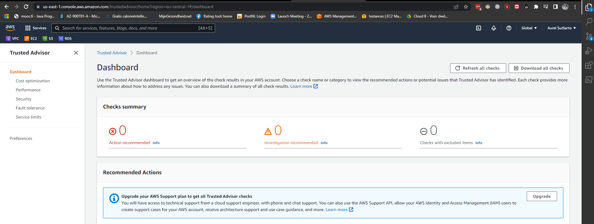

# [ECS, AWS Support Plans, Trusted Advisor]
Study ECS and its utility. Describe the AWS support Plans and the AWS trusted Advisor. Understand what AWS Config and CloudTrail are about and how it can help u with managing AWS resources. 

## Key terminology
- **computing**: In cloud computing, the term compute describes concepts and objects related to software computation. Compute is a generic term used to reference all the resources required for a program to successfully run. These resources include the processing power, memory, and other necessary resources needed for the computational success of the program. 
- **containers**: Container images contain the code and the environment necessary to run the code such as the system libraries, settings, code, and other necessary dependency for the code to run.  

    When to consider containers: 
    - compute intensive workloads
    - large monotlithic applications
    - when you need to scale quickly
    - when you need to move a large app to the cloud without latering the code

    When not to consider containers: 
    - when apps needs persistent data storage
    - when apps have complex networking, routing or security requirem

### Sources
- [AWS ECS](https://docs.google.com/document/d/1f5MXAOSmHZNu6bUpMtkuIWbQoADyVJ1oygTea6wHpDo/edit)
- [AWS Skillbuilder Compute Services](https://explore.skillbuilder.aws/learn/course/199/play/45928/aws-compute-services-overview)
- [AWS support plans](https://aws.amazon.com/premiumsupport/plans/)
- [AWS config](https://aws.amazon.com/config/)
- [Trust adviser, CloudTrail](https://explore.skillbuilder.aws/learn/course/134/play/31418/aws-cloud-practitioner-essentials-all-modules;lp=82)

  
### Overcome challenges
- Looked up key terminology
- Used the AWS skillbuilder to get to know the differences in similar services 

# ECS
1. **Utility**: 
    Amazon ECS is a fully managed container orchestration service that helps you easily deploy, manage, and scale containerized applications. Users the don't have to configure/manage their own container management as ECS runs and manages containers in a cloud cluster. 
    Running containers on ECS can be done with EC2 instances or Fargate.  

    Example: A payroll application is running customized code. The code is complex and the application needs to migrate without any changes to the underlying code.
    
1. **Replacement in classical setting**:  
    With containers, you can package entire applications and move them to the cloud without the need to make any code changes. The application can be as large as you need it to be and can run as long as you require it to run. In a classical setting it would be done manually and without having the option to migrate all code at once, where the risk of faulty migrating would increase. 

2. **Combining ECS with other services**:  
   Combined with Fargate: AWS Fargate is a technology that you can use with Amazon ECS to run containers without having to manage servers or clusters of Amazon EC2 instances. With Fargate, you no longer have to provision, configure, or scale clusters of virtual machines to run containers. This removes the need to choose server types, decide when to scale your clusters, or optimize cluster packing.

3. **Differences between other computing options**:
   - Other computing resources in AWS:
     - EC2: virtual server instances: up to user to determine what type of instance to use and when to scale them.   
       - example: You have an application that handles large education conferences and requires access to the operating system (OS) and control of the underlying infrastructure. 
     - AWS Fargate: AWS managed serverless offering running containers on AWS Fargate. No need to go bother with the underlying infrastructure with this service. 
     - AWS Lambda: serverless computing: running stateless code in response to triggers
       - example:  development team in a startup company is comfortable with breaking their code into small pieces. The team want to focus its resources on business logic and not on infrastructure.

# AWS supported plans
There are 4 Support plans to choose from: 
1. Basic:
   - Free for all AWS customers, includes whitepapers, documentationn and support communities. Contact AWS for billing questions and service limit increases. You've got access to a limited selection of AWS Trusted Advisor checks. Additionally, you can use the AWS Personal Health Dashboard, a tool that provides alerts and remediation guidance when AWS is experiencing events that may affect you. 

2. Developer:
    - Best practice guidance
    - Client-side diagnostic tools
    - Building-block architecture support, which consists of guidance for how to use AWS offerings, features, and services together
  
3. Business:
   - Use-case guidance to identify AWS offerings, features, and services that can best support your specific needs
   - All AWS Trusted Advisor checks
   - Limited support for third-party software, such as common operating systems and application stack components
  
4. Enterprise: 
   
   In addition to all the features included in the Basic, Developer, and Business Support plans, customers with an Enterprise Support plan have access to features such as:

   - Application architecture guidance, which is a consultative relationship to support your company’s specific use cases and applications
   - Infrastructure event management: A short-term engagement with AWS Support that helps your company gain a better understanding of your use cases. This also provides your company with architectural and scaling guidance.
   - A Technical Account Manager

# Trusted Advisor
AWS has an automated advisor called AWS Trusted Advisor. This is a service that you can use in your AWS account that will evaluate your resources against five pillars. The pillars are cost optimization, performance, security, fault tolerance, and service limits. Trusted Advisor in real time runs through a series of checks for each pillar in your account, based on AWS best practices, and it compiles categorized items for you to look into, and you can view them directly in the AWS console. 

When you access the Trusted Advisor dashboard on the AWS Management Console, you can review completed checks for cost optimization, performance, security, fault tolerance, and service limits.

# AWS Config
AWS Config is a service which can be used for continuous monitoring and assessing of AWS resources which eases you as a customer to evaluate and change more efficiently/effectively into desired configurations. AWs Config enables the customer to deep dive intro detailed resource configurations histories (which simpliefies troubeleshoutting) and determine overall compliance against configurations specified in the companies internal guidelines. 

# Cloud Trail
AWS CloudTrail records API calls for your account. The recorded information includes the identity of the API caller, the time of the API call, the source IP address of the API caller, and more. You can think of CloudTrail as a “trail” of breadcrumbs (or a log of actions) that someone has left behind them.