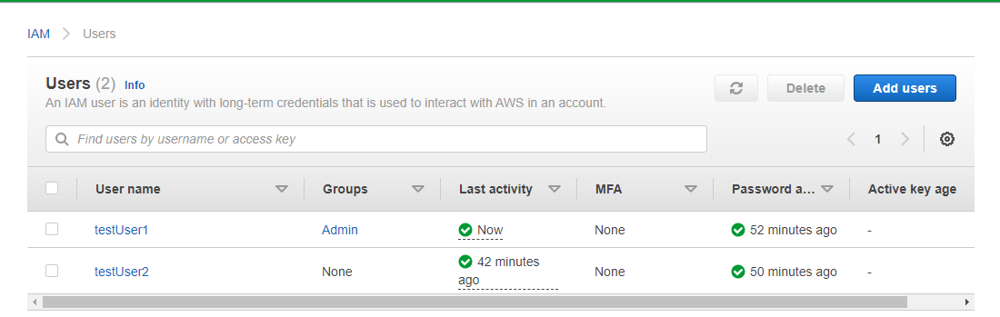
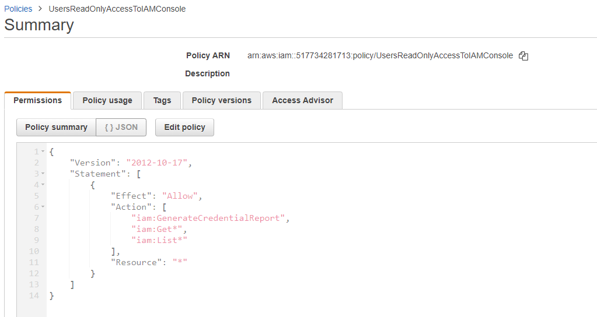
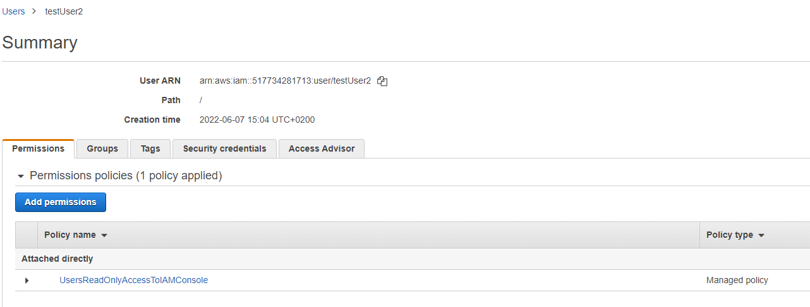
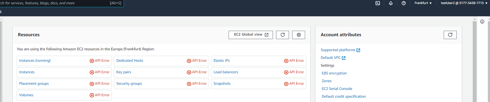

# [IAM]
IAM stands for Identity and Access Management; manage permissions to a workforce and systems. 

## Key terminology
- **least privileged permission**: when setting permissions with IAM policies, you only grany permissions to perform a task. Applying this privilige is done by defining the actions that can be taken on specific resources under specific conditions. 
- **IAM identities**:
  - user groups: collection of IAM users. Use groups to specify permissions for a collection of users.
  - users:  an identity with long-term credentials that is used to interact with AWS in an account.
  - roles: similar to user, but has no credentials associated with it. Instead of being linked with one person, a role is intended to be assumable by anyone who needs it. An IAM user can assume a role to temporarily take on different permissions for a specific task.
- **role-based access control (RBAC)**: RBAC provides a way for you to assign permissions based on a person’s job function, known outside of AWS as a role. IAM provides RBAC by defining IAM roles with permissions that align with job functions.
- **attribute-based access control (ABAC)**: ABAC is an authorization strategy that defines permissions based on attributes. In AWS, these attributes are called tags, and you can define them on AWS resources, IAM roles, and in role sessions. With ABAC, you define a set of permissions based on the value of a tag.
- **temporary credentials in IAM**: are used primarily with IAM roles, but does not exclude other uses. You can request temporary credentials that have a more restricted set of permissions than your standard IAM user. This prevents you from accidentally performing tasks that are not permitted by the more restricted credentials. 
- **policies within IAM**: Policies are JSON documents in AWS that let you specify who has access to AWS resources, and what actions they can perform on those resources. 

## Exercise
Create and attach your first customer managed policy. 
1.  Create the policy
By default, IAM users do not have permissions to do anything. They cannot access the AWS Management Console or manage the data within unless you allow it. In this step, you create a customer managed policy that allows any attached user to sign in to the console.

2.  Attach the policy
When you attach a policy to a user, the user inherits all of the access permissions that are associated with that policy. In this step, you attach the new policy to a test user account.

3.  Test user access
Once the policy is attached, you can sign in as the user and test the policy.

### Sources
-   [IAM FAQ](https://aws.amazon.com/iam/faqs/?nc=sn&loc=5) 
-   [IAM tutorial](https://docs.aws.amazon.com/IAM/latest/UserGuide/tutorial_managed-policies.html)

### Overcome challenges
Studied AWS Identity and Acces Management by reading up about identities with IAM, its access management and security. 

### Results
1. I logged into my root account and made 2 IAM users. 
2. Create 2 IAM users:
   - user 1 admin rights
   - user 2 had no permissions, no group or policy attached.
   - 
3. Create a policy in JSON format where it's only possible to read at the AWS Management Console. 
   - 
4. Attached the policy to a user

5. Behold the restriction when testUser2 is signed in the AWS Management Console. User2 is only allowed to read, but not create or edit anything  .
