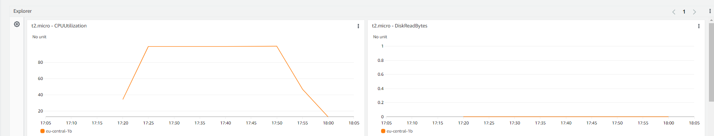
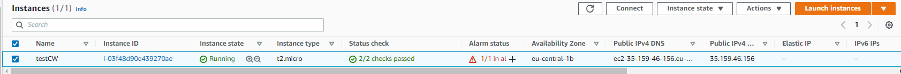
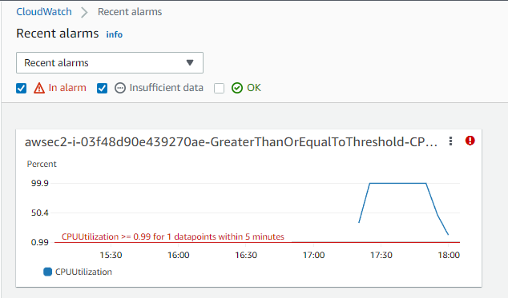

# [AWS CloudWatch]
CloudWatch is a monitoring and observability service for used resources. This service provides you with data and insights to monitor apps, performance changes and resource utilization. 

**CloudWatch Logs Insights**:
Amazon CloudWatch Logs Insights is an interactive, pay-as-you-go, and integrated log analytics capability for CloudWatch Logs. It helps developers, operators, and systems engineers understand, improve, and debug their applications, by allowing them to search and visualize their logs. 

**CloudWatch Contributor Insights**
Amazon CloudWatch now includes Contributor Insights, which analyzes time-series data to provide a view of the top contributors influencing system performance.

**CloudWatch ServiceLens**
Amazon CloudWatch ServiceLens is a new feature that enables you to visualize and analyze the health, performance, and availability of your applications in a single place.

**CloudWatch Synthetics**
Amazon CloudWatch Synthetics allows you to monitor application endpoints more easily. It runs tests on your endpoints every minute, 24x7, and alerts you as soon as your application endpoints don’t behave as expected. 

## Exercise
Monitor an EC2 instance and set an CloudWatch alarm. 

### Sources
[CloudWatch](https://docs.aws.amazon.com/AmazonCloudWatch/latest/monitoring/cloudwatch_architecture.html)

### Overcome challenges
- None, have been looking at CloudWatch monitoring several times for assignements. 

### Results
1. Made an EC2 instance with a load test web server. CPU Usage can be seen in next image. 
2. Made an alarm if CPU > 99%
3. Alarm with CPU Threshold
