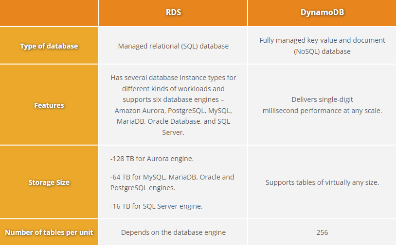

# [DynamoDB]
DynamoDB is a fully managed database service of AWS. A NoSQL database service providing fast and predictable performance. With this service you create database tables which can be scaled up or down throughput capacity without downtime or performance degradation. DynamoDB automatically spreads the data and traffic for your tables over a sufficient number of servers to handle your throughput and storage requirements. DynamoDB also offers encryption at rest, which eliminates the operational burden and complexity involved in protecting sensitive data. All of your data is stored on solid-state disks (SSDs) and is automatically replicated across multiple Availability Zones in an AWS Region, providing built-in high availability and data durability.

DynamoDB or RDS?

## Key terminology
- **non relational databases**: In a nonrelational database, you create tables. A table is a place where you can store and query data. 
Nonrelational databases are sometimes referred to as NOSQL databases because they use structures other than rows and columns to organize data. One type of structural approach for nonrelational databases is key-value pairs. 
**key-value**: With key-value pairs data is organized into items (keys), and items have attributes (values). You can think of attributes as being different features of your data. A key-value database stores data as a collection of key-value pairs in which a key serves as a unique identifier.
- **serverless**: to build and run applications and services without having to manage infrastructure
- **global secondary indexes**: second index query with different attributes attached to it

## Exercise
Getting started guide of AWS DynamoDB. 
- Step 1: Create a Table
- Step 2: Write Data to a Table Using the Console or AWS CLI
- Step 3: Read Data from a Table
- Step 4: Update Data in a Table
- Step 5: Query Data in a Table
- Step 6: Create a Global Secondary Index
- Step 7: Query the Global Secondary Index

### Sources
- [Amazon DynamoDB](https://aws.amazon.com/dynamodb/)
- https://aws.amazon.com/getting-started/hands-on/create-nosql-table/
- [RDS VS DynamoDB](https://tutorialsdojo.com/amazon-rds-vs-dynamodb/)
- Killian

### Overcome challenges
Didn't know about non-relational database so I looked that up, followed by some DynamoDB documentation and practical exercise. 

### Results
1. Created a table named 'Music' with the 2 keys, 'artist' and 'song title', added some attributes afterwards.
2. Proof of table and created items
   -    
3. Filtered on query
   -    
4. Made global secondary index. 
   - 
5. Filtered on Global secondary index. Note: when making the index fill in the 'partition key' (query) and leave the optional sort key open for this case. 
   
    

