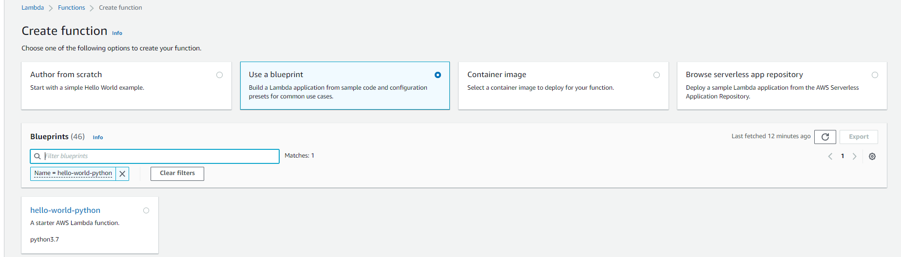
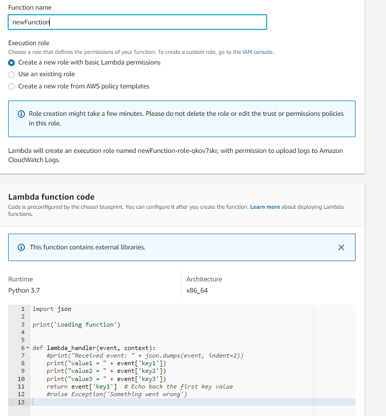
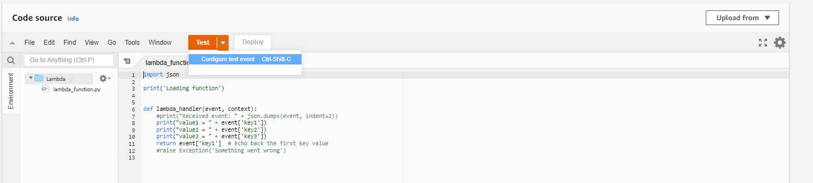
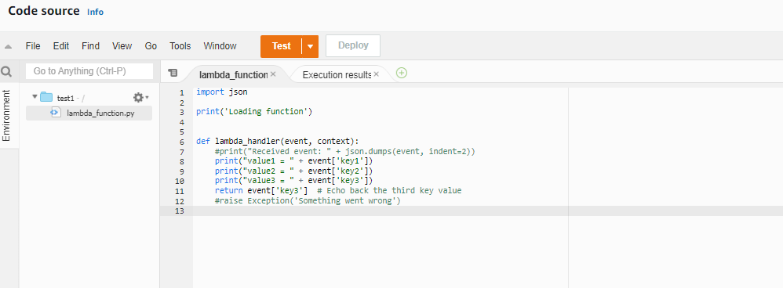
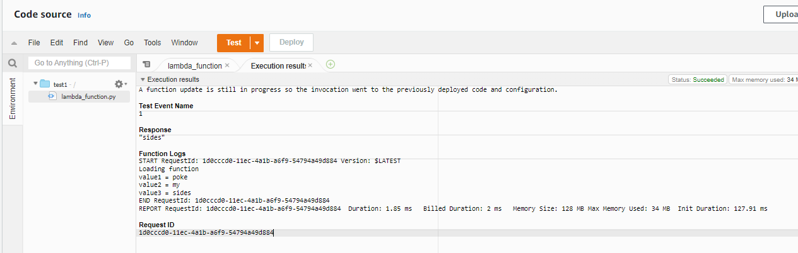

# [AWS Lambda]
Lambda is a serverless compute service, run code at scale without worrying about servers (maintaining, patching, security, scaling). With Lambda you write 'Functions'; create, update, deploy.

In the early computing days it was expensive to buy and maintain infrastructure/hardware (traditional company specific data centers). In the mid 2000's there was a new development upcoming: early cloud infrastructure (AWS EC2 big player): managed service to order compute capacity. Followed by the 2014+ development: enhanced cloud infrastructure. AWS Lambda was introduced. It is still compute service (run and execute code) BUT you only pay for when the code is being runned. So overall much more cost effective when having changing access patterns. 

Benefits
- no infrastructure to maintain
- autoscaling
- pay for what you use/pay per invokaction
- easy and fitting AWS service integrations (DynamoDB, S3, EFS, )

Use cases: 
- API hosting
- event processing
- ad-hoc or timer based jobs

## Key terminology
- **blueprint**: Blueprints provide example code to do some minimal processing. Most blueprints process events from specific event sources, such as Amazon S3, DynamoDB, or a custom application.

## Exercise
[Run a serverless Function](https://aws.amazon.com/getting-started/hands-on/run-serverless-code/)

1. Enter Lambda Console and select Lambda Blueprint
2. Configure and create your lambda function
3. Invoke Lambda function and verify results

### Sources
- [AWS Lambda](https://aws.amazon.com/lambda/)
- Killian 

### Overcome challenges
- Learned about Lambda and its utility, but kept it basic. 
- Looked up the 'Getting Started' to do a practical. 

### Results

1. Create function by choosing option 'blueprint'
   -    
2. Configuring the blueprint.
   -    
3. Confugure a test event
   - 
4. Made test event to return 'value3', deploy. 
   - 
5. Run test event  
   - 
