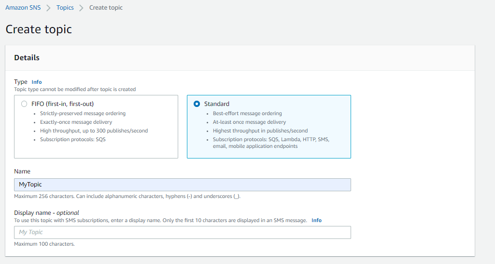
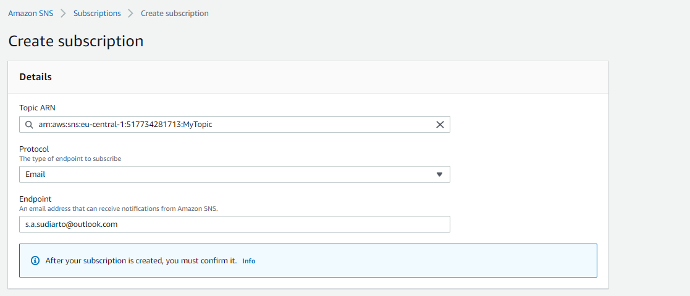
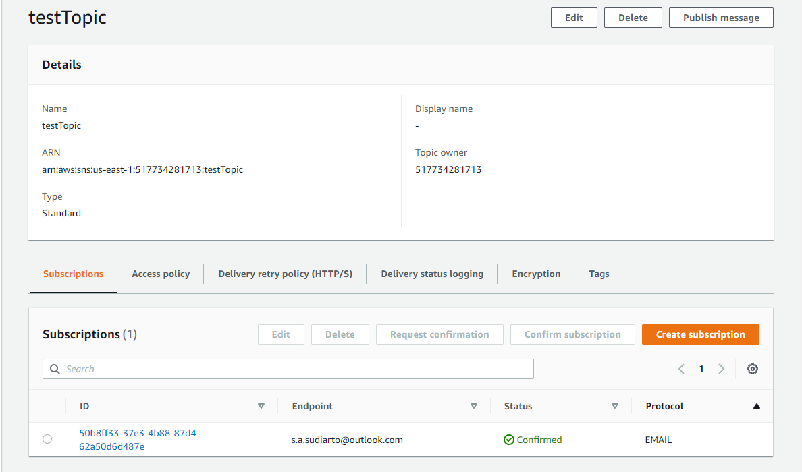
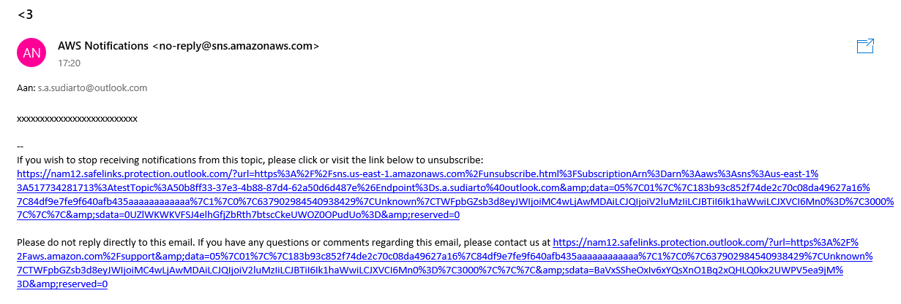

# [SNS, SQS & EventBridge]
Amazon Simple Notification Service (Amazon SNS) is a fully managed messaging service for both application-to-application (A2A) and application-to-person (A2P) communication. It sends messages from a topic (resource) to subscribers (resources or people). The service is designed to make web-scale computing easier for developers. 

Amazon Simple Queue Service (SQS) is a fully managed message queuing service that enables you to decouple and scale microservices, distributed systems, and serverless applications. 

Amazon EventBridge is a service that provides real-time access to changes in data in AWS services, your own applications, and software as a service (SaaS) applications without writing code. To get started, you can choose an event source on the Amazon EventBridge console, and select a target from a number of AWS services including AWS Lambda, Amazon Simple Notification Service (SNS), and Amazon Kinesis Data Firehose. Amazon EventBridge will automatically deliver the events in near-real-time.

## Key terminology
- **microservices**: 
- **pub/sub messaging**: Publish/subscribe messaging, or pub/sub messaging, is a form of asynchronous service-to-service communication used in serverless and microservices architectures. In a pub/sub model, any message published to a topic is immediately received by all of the subscribers to the topic. Pub/sub messaging can be used to enable event-driven architectures, or to decouple applications in order to increase performance, reliability and scalability.

## Exercise 1
[Becoming familiar with Amazon SNS](https://docs.aws.amazon.com/sns/latest/dg/sns-getting-started.html#sns-prerequisites)
1. Create a topic
2. Create a subscription to the topic
3. Publish a message to the topic
4. Delete the subscription and topic

### Sources
- [SNS](https://aws.amazon.com/sns/?whats-new-cards.sort-by=item.additionalFields.postDateTime&whats-new-cards.sort-order=desc)
- [SQS](https://aws.amazon.com/sqs/)
- [Eventbridge](https://aws.amazon.com/eventbridge/faqs/)
- Killian and Ben

### Overcome challenges
[Give a short description of your challanges you encountered, and how you solved them.]

### Results

## SNS
1. Create topic
   - 
2. Create subscription
   -    
3. Subscription confirmed
   - 
4. Subscription in dashboard
   - 
5. Published message received!
   - 

