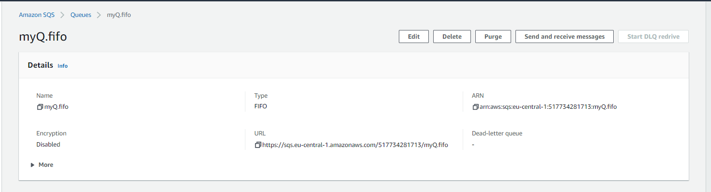

# [SNS, SQS & EventBridge]

## SNS
Amazon Simple Notification Service (Amazon SNS) is a fully managed messaging service for both application-to-application (A2A) and application-to-person (A2P) communication. It sends messages from a topic (resource) to subscribers (resources or people). The service is designed to make web-scale computing easier for developers. 

# SQS
Amazon Simple Queue Service (SQS) is a fully managed message queuing service that enables you to separate and scale microservices and serverless applications. 

Amazon SQS provides short polling and long polling to receive messages from a queue. By default, queues use short polling.

- Differences SQS and SNS

SNS - sends messages to the subscriber using push mechanism and no need of pull. SQS - it is a message queue service used by distributed applications to exchange messages through a polling model, and can be used to decouple sending and receiving components

## EventBridge
Amazon EventBridge is a service that provides real-time access to changes in data in AWS services, your own applications, and software as a service (SaaS) applications without writing code. It's a serverless event bus that supports the publish/subscribe messaging. 

## Key terminology
- **microservices**: small pieces of software that deliver specific functions, running separately from each other: they do 'one thing'. 
- **Dead-letter queue (DLQ)**: rather than keeping messages in decline in the primary SQS queue, once the specified number of retries are met, the message will get transferred to that dead-letter queue.
- **pub/sub messaging**: Publish/subscribe messaging, or pub/sub messaging, is a form of asynchronous service-to-service communication used in serverless and microservices architectures. This type of messaging is used for streaming analytics and data integration pipelines to consume and distribute data.

### Sources
- [SNS](https://aws.amazon.com/sns/?whats-new-cards.sort-by=item.additionalFields.postDateTime&whats-new-cards.sort-order=desc)
- [SQS](https://aws.amazon.com/sqs/)
- [Eventbridge](https://aws.amazon.com/eventbridge/faqs/)
- Killian and Ben

### Overcome challenges
- Looked up the subjects and got confused at what EventBridge actually does. After doing the practical and using all three resources together the 'dime dropped'.

### Results

## SNS
Send a message to subscribers using SNS, in this case endpoint is e-mail. 
1. Create topic
   - 
2. Create subscription
   -    
3. Subscription confirmed
   - 
4. Subscription in dashboard
   - 
5. Published message received!
   - 

## SQS
Create a queue and link it to SNS topic
1. Create SNS topic with FIFO
   
2. Create SQS Queue 
   -  
3. Link the topic and queue
   -  
4. Send message from SNS to SQS
   -  
   -  
5. Read one of the messages out 
   -

## S3, Eventbridge, SNS and SQS
Create an S3 bucket and use message services to send a log event with Eventbridge, SNS and SQS.
1. Create a S3 bucket and set EventBridge notification ON 
   
2. Create a standard SNS topic
   
3. Create a standard SQS queue
   
4. Subscribe queue to topic
   
5. Create a rule in EventBridge to trigger a response if anything is edited to a specific S3 bucket it will send a log message to a topic (SNS) and directs the message to the subscribed.
   - 
   - 
   - 
   - 
6. Add file to S3 bucket
   
7. Check the designated queue.
   - 
8. Check the message in queue.
   - 