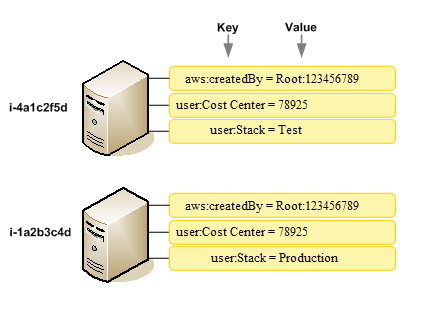

# [Digital CloudTraining Practice Exam] 1
Do the practice exam on the Digital Cloud Training and review the answers. There was IT jargon which I didn't recognize yet. Those terms were looked up. 

## Key terminology

### general key terms
- **access keys**: long term credentials for  IAM user or AWS account root user used for signing in to programmatic requests to AWS CLI or AWS API. Consists of two parts: ID and secret access key. Best practice is to temp. sec. creds. (IAM roles) instead of access keys. 
- **agility**: the ability to quickly adapt to changes (rapidly develop, test and launch)
- **consolidated billing**: if a company uses multiple AWS accounts Consolidated Billing enables it to group these costs into a single paying account. With this feature u can also track the charges across multiple accounts and download the combined costs and usage data. Combined usage of resources in different accounts may give volume pricing discounts, use more pay less. 
  - one bill
  - easy tracking
  - combined usage (volume pricing discounts)
  - no extra fee
- **legay applications**: applications which may be based on outdated technologies 
- **firmware**: specific class of computer software that provides the low-level control for a device's specific hardware
- **dedicated hosts**: is a physical server fully dedicated to a customers use, this 'host' can run prefered/eligible software licenses from other vendors (Microsoft, Oracle). Dedicated Hosts give you additional visibility and control over how instances are placed on a physical server, and you can reliably use the same physical server over time.
- **dedicated instances**: EC2 instances that run in a VPC on hardware that's dedicated to a single customer. Physically isolated on at the host hardware level  from other AWS customers instances. 
- **transit gateway**: AWS Transit Gateway connects your Amazon Virtual Private Clouds (VPCs) and on-premises networks through a single gateway.
- **batch job**: scheduled program that is assigned to run without furter user interaction.
- **bare metal**: computer system without a base OS or any installed application
- **managed software version control system**: software system where you can track and manage codes like Github. 
- **cost allocation tags**: label that a practitioner (user defined tags) or AWS (AWS generated tags) assigns to an AWS resource, this tag consists of a key and a value. Tags can help with organizing your resources and to track your AWS costs on a detailed level.
  - 
- **pipeline**: is a workflow construct that describes how software changes go thourgh a release process. 
  - workflow: defined by stages and actions
    - stages: group of one or more actions
      - actions: task performed on revision
  
### AWS resources (new)
- **AWS Organizations**: manage and organise multiple AWS accounts and apply specific policies to the group of accounts. It helps you programmatically create new accounts and allocate resources, provides consolidated billing, create groups of accounts to organize workflows and applyc policies to them 
  
- **AWS Personal Health Dashboard**: provides alerts and remediation guidance when services are experiencing events that may have impact on your resources
  - personalized view of service health
  - notifications
  - troubleshooting guidance
  - integration and automation (w. Eventbridge coöp Lambda)
  - acces control with IAM
  - aggregate health events across AWS Organizations

- **CodePipeline**: fully managed service which automates software deployment process for continuous delivery (build, tests and deploy)
- **CodeDeploy**: service that automates code deployment to any instance
- **CodeCommit**: source control system to manage code 
- **Software Development Kit**: collection of software development tools in a kit
- **AWS Cost Management Tools**: budgeting and forecasting costs and methods for you to optimize your pricing to reduce your overall AWS bill
- **CodeGuru**: developer tool to improve code quality and optimize perforemace for apps by providing intelligent recommendations
- **Appstream 2.0**: fully managed non-persistent application and desktop streaming service that provides users instant access to their desktop applications from anywhere.
- **Policy Generator**: simplifies the process of creating policy documents for the Amazon Simple Queue Service (SQS), Amazon S3, the Amazon Simple Notification Service (SNS), and AWS Identity and Access Management (IAM)
- **Macie**: fully managed data security and data privacy service that uses machine learning and pattern matching to discover and protect your sensitive data in AWS
- **GuardDuty**: threat detection service that continuously monitors your AWS accounts and workloads for malicious activity and delivers detailed security findings for visibility and remediation
- **Detective**: makes it easy to analyze, investigate, and quickly identify the root cause of potential security issues or suspicious activities. Amazon Detective automatically collects log data from your AWS resources and uses machine learning, statistical analysis, and graph theory to build a linked set of data that enables you to easily conduct faster and more efficient security investigation
- **Connect**: public cloud customer contact center service. Amazon Connect enables customer service representatives to respond to phone calls or chat inquiries from end customers just as if the contact center infrastructure was set up and managed on premises
- **DirectConnect**: links your internal network to an AWS Direct Connect location over a standard Ethernet fiber-optic cable. One end of the cable is connected to your router, the other to an AWS Direct Connect router. With this connection, you can create virtual interfaces directly to public AWS services (for example, to Amazon S3) or to Amazon VPC, bypassing internet service providers in your network path.
- **Outposts**: fully managed and configurable compute and storage racks built with AWS-designed hardware that you can use to operate a seamless hybrid cloud
- **Workspaces**: nables you to provision virtual, cloud-based Microsoft Windows or Amazon Linux desktops for your users, known as WorkSpaces.

### AWS Resources (repeat)
- **EC2**
  - scaling policy
    - step scaling: choose scaling metrics and set treshold boundaries with ClouWatch to set Alarams that trigger scaling process
    - scheduled: Scheduled scaling helps you to set up your own scaling schedule according to predictable load changes. 
    - target tracking: select a scaling metric and set a target value. Amazon EC2 Auto Scaling creates and manages the CloudWatch alarms that trigger the scaling policy and calculates the scaling adjustment based on the metric and the target value. 
    - predictive: Predictive Scaling predicts future traffic, including regularly-occurring spikes, and provisions the right number of EC2 instances in advance.
- **S3**
  - bucket policy: resource based policy to grant access permissions to a bucket and the objects in it
- **reserved instances**
    - Standard: These provide the most significant discount, but can only be modified. Standard Reserved Instances can't be exchanged.

    - Convertible: These provide a lower discount than Standard Reserved Instances, but can be exchanged for another Convertible Reserved Instance with different instance attributes. Convertible Reserved Instances can also be modified.
- **differences CloudTrail and CloudWatch**: 
  - Cloudwatch is a monitoring service that gives you visibility into the performance and health of your AWS resources and applications
  - Cloudtrail is a service that logs AWS account activity and API usage for risk auditing, compliance and monitoring

