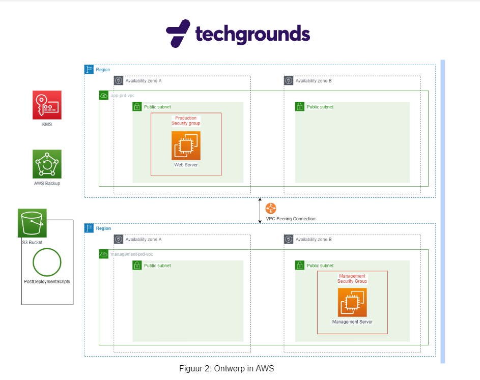

# Overview of requirements
This document is an overview of the requirements of the the first version of the final project. The project is to deliver an Infrastructure as Code app which works in the AWS CDK. 

1. 2 VPC's, each with 2 public subnets
   - subnets must have a firewall
   - IP ranges
     - 10.10.10.0/24
     - 10.20.20.0/24
2. Each subnet in different Availability zones
3. VPC peering connection between these 2 subnets
4. One VPC has a **web server** and a **production security group**
   - running web page:
     -  must be installed automatically by using a bash script in User Data
   - production security group:
     - SSH or RDP(!) connection must be only enabled from the admin server
5. The other VPC has a **management** server with a **management security group**
   - management security group:
     - must be accessed by PUBLIC IP
     - must be accessed by OFFICE/ADMIN'S home
6. AWS Backup has to be added for a **daily** back-up of the **webserver**, the data of this back up has to be stored for 7 days
7. AWS S3 bucket has to store post deployment scripts.
8. Added requirement while project was ongoing: admin server must be running Windows. 

## Deliverables
- Working CDK app 
- Design document
- Time logs

## Diagram which was added: 
